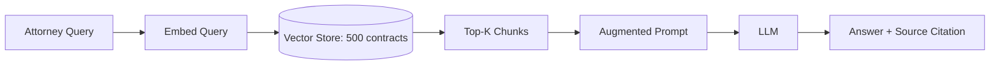

## Phase 1 — RAG Foundations (LexClear) (Weeks 1–5)

### Week 1 — Basic RAG: Attorney Q&A Pilot
**Pattern:** Pattern 6 — Basic RAG · **Level:** Beginner

🎯 **Problem statement:** LexClear's attorneys currently search the firm's document management system (iManage-style) by keyword only. A senior partner asks "what indemnification language do we typically use in SaaS vendor contracts" — the keyword search returns nothing useful because the actual clauses are titled "Vendor Liability and Indemnity" and phrased in ways that never contain the word "typically." The firm wants a 3-attorney pilot before committing budget to a full rollout.

📚 **Resources:**
- [Pinecone: What is Retrieval-Augmented Generation?](https://www.pinecone.io/learn/retrieval-augmented-generation/) — the mental model
- [Original RAG paper (Lewis et al., 2020)](https://arxiv.org/abs/2005.11401) — where the pattern comes from
- [LangChain RAG tutorial](https://python.langchain.com/docs/tutorials/rag/) — a reference implementation to compare your own against

🔨 **Steps (pilot-grade, not toy-grade):**
1. Assemble a representative 500-contract sample: mix of vendor agreements, NDAs, employment contracts, and leases, spanning at least 3 of the firm's 12 jurisdictions — a single-contract-type sample will hide real retrieval failure modes
2. Strip and normalize source formatting (these are Word-exported PDFs with headers/footers/page numbers that will pollute chunks if untouched)
3. Chunk naively (fixed-size, no cleverness yet — that's Week 2), embed, load into a vector store
4. Embed the incoming query, retrieve top-k, stuff into the prompt with the source contract name and section visible
5. Generate an answer, grounded, refusing rather than guessing when the corpus doesn't contain a relevant clause
6. Write 15 realistic attorney-style test questions (not academic RAG-benchmark questions) with hand-verified correct source clauses, drawn from actual partner requests if you can get them
7. Grade retrieval accuracy and generation accuracy *separately* — a right answer built on the wrong retrieved chunk is a hidden failure that will resurface later at scale
8. Define the pilot's go/no-go bar in writing before you show it to the 3 attorneys (e.g., "90%+ retrieval@5 on the test set, zero hallucinated clause citations")

🧩 **Architecture:**

🔗 **System Integration — where this sits in LexClear:**

```mermaid
flowchart LR
    A[Document Sources: DMS, email] --> B[Ingestion & Chunking]
    B --> C[Embedding]
    C --> D[(Vector Store + Neo4j)]
    D --> E[Retrieval Layer]
    E --> F[Generation Layer]
    F --> G[Guardrails + Citations]
    G --> H[Cache]
    H --> I[LiteLLM Gateway]
    I --> J[Attorney Chat UI]

    style E fill:#e63946,stroke:#fff,stroke-width:3px,color:#fff
    style F fill:#e63946,stroke:#fff,stroke-width:3px,color:#fff
```

This week builds the E→F core. Everything else in the diagram — access-controlled ingestion, reranking, guardrails, caching, the gateway — is a later week's upgrade to this same spine, not a separate system.

✅ **Production note:** even at this stage, log retrieval scores per query — it's the cheapest debugging tool you'll ever build, and it's what Week 26 will mine for real traffic patterns.

📁 `01_basic_rag/`
