# AI-Patterns — A Weekly Applied Curriculum for Production GenAI Systems

This repo is a hands-on, portfolio-grade lab notebook for RAG, agents, MCP, and LLM serving. Every folder is one week, one use case, one (or two) design pattern(s), built the way you'd actually ship it — not a notebook demo.

The pattern catalog is anchored to **[Generative AI Design Patterns](https://www.oreilly.com/library/view/generative-ai-design/9798341622654/)** by Valliappa Lakshmanan and Hannes Hapke (O'Reilly). Wherever a week maps to a numbered pattern from the book, it's tagged **Pattern #N**, and the book's own repo (`examples/NN_pattern_name`) is your reference implementation to compare against. Where the ask went beyond the book's 32 patterns — MCP, LiteLLM, vector DB internals, memory frameworks — those weeks are tagged **Ecosystem Pattern** and sourced from current framework docs instead.

A few things worth saying up front, given where you're starting from:

- **This isn't a from-zero curriculum.** You've already shipped Documind (hybrid search + Neo4j knowledge graphs + Qdrant in production), benchmarked vector databases in VectorLens, and fine-tuned CodeGuard-7B with DPO. Several "beginner" weeks below will feel more like *"extract the clean, minimal, teachable version of something I already know"* than *"learn this for the first time"* — that's intentional and it's the harder skill anyway.
- **You already have a dedicated vLLM/LiteLLM/serving curriculum.** Phase 6 here doesn't re-teach that from scratch — it's framed as *"take what you already know and ship one clean, documented production pattern per week"* for this repo specifically.
- **Every folder is portfolio content.** This directly supports your "RAG & LLM Systems Specialist" Upwork positioning — each week ends in a working demo + README + diagram you can link to, screenshot, or reference in a proposal.
- **Model provider:** examples default to routing through `OPEN_ROUTER_API_KEY` (already in your `.env.example`), since it lets every week swap models without touching code. Swap for a direct provider key anywhere that's cleaner.

---

## Table of Contents

1. [How This Roadmap Works](#how-this-roadmap-works)
2. [Repo Structure & Per-Week Convention](#repo-structure--per-week-convention)
3. [Environment & Tooling](#environment--tooling)
4. [Quick Reference — All 30 Weeks](#quick-reference--all-30-weeks)
5. [Phase 1 — RAG Foundations](#phase-1--rag-foundations-weeks-1-5)
6. [Phase 2 — RAG Intermediate](#phase-2--rag-intermediate-weeks-6-10)
7. [Phase 3 — RAG Advanced / Expert](#phase-3--rag-advanced--expert-weeks-11-14)
8. [Phase 4 — Agents](#phase-4--agents-weeks-15-20)
9. [Phase 5 — MCP](#phase-5--mcp-model-context-protocol-weeks-21-22)
10. [Phase 6 — Serving, Inference & LLMOps](#phase-6--serving-inference--llmops-weeks-23-27)
11. [Phase 7 — Safety, Fine-Tuning & Capstone](#phase-7--safety-fine-tuning--capstone-weeks-28-30)
12. [Suggested Weekly Rhythm](#suggested-weekly-rhythm)

---

## How This Roadmap Works

30 weeks, ~7 months at one use case a week. Treat weeks as milestones, not deadlines — skip a week you've effectively already shipped (fold in a `NOTES.md` explaining what you're reusing from Documind/VectorLens instead of rebuilding), and slow down on the ones that are genuinely new.

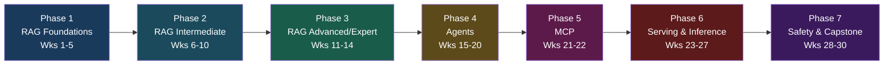

Difficulty labels (Beginner/Intermediate/Advanced/Expert) rate the *pattern's* inherent complexity, not your starting point — given Documind and VectorLens, you'll likely blow through several "Beginner" weeks fast. Keep them as clean, minimal, well-documented reference implementations anyway — that's what makes them reusable in interviews and proposals.

---

## Repo Structure & Per-Week Convention

Mirroring the book's own `examples/NN_pattern_name/` convention, each week gets a numbered, underscore-slugged folder at the repo root:

```
AI-Patterns/
├── myenv/                          # gitignored venv
├── .env / .env.example
├── .gitignore
├── LICENSE
├── me.md
├── README.md                       # this file
├── 01_basic_rag/
│   ├── README.md                   # problem, pattern(s), steps, diagram, resources
│   ├── src/
│   ├── diagrams/                   # exported PNG/SVG if you want them outside the README
│   ├── requirements.txt            # or pyproject.toml
│   ├── .env.example
│   ├── tests/
│   └── NOTES.md                    # what you'd change for real production — mirrors the
│                                    # book's own USAGE.md citation convention
├── 02_chunking_and_embeddings/
├── 03_vector_db_deep_dive/
...
└── 30_capstone_production_platform/
```

Each week's `README.md` should be a smaller version of the entries below: a problem statement, the pattern(s) applied, a diagram, steps, and a "why this matters in production" note. `NOTES.md` is where you write the honest retro — what broke, what you'd do differently at scale. That file is what turns a demo folder into an interview talking point.

---

## Environment & Tooling

| Layer | Default choice | Notes |
|---|---|---|
| Language | Python 3.11+ | `uv` for env/package management is worth adopting — vLLM's own docs now lead with it |
| Model access | OpenRouter (`OPEN_ROUTER_API_KEY`) → LiteLLM later | Start direct, move behind LiteLLM in Phase 6 |
| Vector DB | Qdrant (Docker) + pgvector (for the Postgres-native weeks) | You've already benchmarked both in VectorLens — use that judgment |
| Orchestration | Raw SDK calls first, LangGraph where the week calls for graph-based agent control | LangGraph has the largest 2026 production footprint for multi-agent work; CrewAI is the faster prototyping alternative |
| API layer | FastAPI | Used from Week 14 onward for anything that becomes a "service" |
| Containers | Docker Compose | Same pattern you already used for Documind |
| Testing | pytest | Every folder should have at least a smoke test |

---

## Quick Reference — All 30 Weeks

| Wk | Use Case | Track | Level | Core Pattern(s) | Folder |
|---:|---|---|---|---|---|
| 1 | Basic RAG pipeline | RAG | Beginner | Pattern 6 — Basic RAG | `01_basic_rag` |
| 2 | Chunking & embedding strategy shootout | RAG | Beginner | Pattern 7 — Semantic Indexing | `02_chunking_and_embeddings` |
| 3 | Vector DB internals (HNSW vs IVF) | RAG | Beginner | Ecosystem — pgvector/Qdrant | `03_vector_db_deep_dive` |
| 4 | Grammar-constrained structured extraction | RAG | Beginner | Pattern 2 — Grammar | `04_structured_extraction` |
| 5 | Prompt/semantic caching for RAG cost control | RAG | Beginner | Pattern 25 — Prompt Caching | `05_prompt_caching_for_rag` |
| 6 | Metadata filtering + indexing at scale | RAG | Intermediate | Pattern 8 — Indexing at Scale | `06_indexing_at_scale` |
| 7 | HyDE & query expansion | RAG | Intermediate | Pattern 9 — Index-aware Retrieval | `07_hyde_query_expansion` |
| 8 | Cross-encoder reranking pipeline | RAG | Intermediate | Pattern 10 — Node Postprocessing | `08_reranking_node_postprocessing` |
| 9 | Citations, confidence & out-of-domain detection | RAG | Intermediate | Pattern 11 — Trustworthy Generation | `09_trustworthy_generation` |
| 10 | **Corrective RAG (CRAG)** | RAG | Intermediate/Advanced | Pattern 11 + 18 — Trustworthy Gen + Reflection | `10_corrective_rag` |
| 11 | GraphRAG on your own corpus | RAG | Advanced | Pattern 9 (extended) — GraphRAG | `11_graphrag` |
| 12 | Agentic deep search (multi-hop) | RAG | Advanced | Pattern 12 — Deep Search | `12_agentic_deep_search` |
| 13 | Self-RAG (self-critique retrieval) | RAG | Expert | Pattern 31 — Self-Check | `13_self_rag` |
| 14 | Capstone: production RAG-as-a-service | RAG | Expert | Multiple, assembled | `14_capstone_rag_api` |
| 15 | Tool calling fundamentals | Agents | Intermediate | Pattern 21 — Tool Calling | `15_tool_calling_fundamentals` |
| 16 | CoT / ReAct reasoning agent | Agents | Intermediate | Pattern 13 — Chain of Thought | `16_cot_react_agent` |
| 17 | Tree of Thoughts planning agent | Agents | Advanced | Pattern 14 — Tree of Thoughts | `17_tree_of_thoughts` |
| 18 | Reflection — self-correcting loops | Agents | Advanced | Pattern 18 — Reflection | `18_reflection_agent` |
| 19 | Code-execution / interpreter agent | Agents | Advanced | Pattern 22 — Code Execution | `19_code_execution_agent` |
| 20 | Multi-agent collaboration + long-term memory | Agents | Advanced | Pattern 23 + 28 — Multi-agent + Memory | `20_multi_agent_and_memory` |
| 21 | Build an MCP server | MCP | Advanced | Ecosystem — MCP | `21_mcp_server` |
| 22 | Multi-server MCP client agent | MCP | Advanced | Ecosystem — MCP | `22_mcp_multi_tool_agent` |
| 23 | Self-hosted serving with vLLM | Serving | Expert | Pattern 26 — Inference Optimization | `23_vllm_serving` |
| 24 | Small models: quantization + speculative decoding | Serving | Expert | Pattern 24 — SLM | `24_slm_quantization_speculative` |
| 25 | LiteLLM gateway: routing, fallback, cost tracking | Serving | Expert | Ecosystem — LiteLLM | `25_litellm_gateway` |
| 26 | Load & degradation testing (TTFT/EERL/TPS) | Serving | Expert | Pattern 27 — Degradation Testing | `26_degradation_testing` |
| 27 | LLM-as-Judge + automated prompt optimization | Serving | Expert | Pattern 17 + 20 — LLM-as-Judge + Prompt Opt | `27_llm_as_judge_prompt_opt` |
| 28 | Guardrails: input/output/tool-call safety rails | Safety | Advanced | Pattern 32 — Guardrails | `28_guardrails` |
| 29 | LoRA/adapter fine-tuning | Safety | Advanced | Pattern 15 — Adapter Tuning | `29_adapter_lora_tuning` |
| 30 | Capstone II: full production platform | Safety | Expert | Everything, assembled | `30_capstone_production_platform` |

---

## Phase 1 — RAG Foundations (Weeks 1–5)

### Week 1 — Basic RAG
**Pattern:** Pattern 6 — Basic RAG · **Level:** Beginner

🎯 **Problem:** Zero-shot LLMs hallucinate on anything outside training data or confidential to you. You need the minimum viable pipeline that grounds answers in real documents.

📚 **Resources:**
- [Pinecone: What is Retrieval-Augmented Generation?](https://www.pinecone.io/learn/retrieval-augmented-generation/) — the mental model
- [Original RAG paper (Lewis et al., 2020)](https://arxiv.org/abs/2005.11401) — where the pattern comes from
- [LangChain RAG tutorial](https://python.langchain.com/docs/tutorials/rag/) — a reference implementation to compare your own against

🔨 **Steps:**
1. Pick a small, real corpus (your own docs, a subset of Documind's data, anything you know well enough to grade answers by hand)
2. Chunk naively (fixed-size, no cleverness yet — that's Week 2), embed, load into a vector store
3. Embed the incoming query, retrieve top-k, stuff into the prompt
4. Generate an answer, grounded, with the source chunks visible in the response
5. Write 10 test questions with known-correct answers and grade retrieval + generation separately

🧩 **Architecture:**
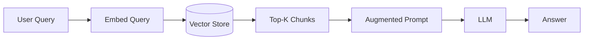

✅ **Production note:** even at this stage, log retrieval scores per query — it's the cheapest debugging tool you'll ever build and you'll want the historical data later (Week 26).

📁 `01_basic_rag/`

---

### Week 2 — Chunking & Embedding Strategy Shootout
**Pattern:** Pattern 7 — Semantic Indexing · **Level:** Beginner

🎯 **Problem:** Chunking is the single highest-leverage, most under-tested decision in a RAG system, and "it depends" isn't a strategy — you need a way to measure which one wins for a given corpus.

📚 **Resources:**
- [Pinecone: Chunking Strategies](https://www.pinecone.io/learn/chunking-strategies/)
- [MTEB Leaderboard](https://huggingface.co/spaces/mteb/leaderboard) — compare embedding models empirically instead of by reputation
- [Sentence-Transformers docs](https://www.sbert.net/)

🔨 **Steps:**
1. Implement three chunkers: fixed-size with overlap, recursive/structure-aware, and semantic (embedding-similarity-based splits)
2. Run the same corpus through all three, embed with 2–3 candidate models from MTEB
3. Build a small retrieval eval set (query → known correct chunk)
4. Score recall@k for every chunker × embedder combination
5. Document the winner and *why* — this table is the deliverable

🧩 **Architecture:**
```mermaid
flowchart TD
    A[Raw Documents] --> B{Chunking Strategy}
    B --> C[Fixed-size + overlap]
    B --> D[Recursive/structure-aware]
    B --> E[Semantic similarity split]
    C --> F[Embedding Model]
    D --> F
    E --> F
    F --> G[(Vector Store)]
    G --> H[Recall@k Evaluation]
```

✅ **Production note:** the "best" chunker is corpus-dependent — this experiment design, not the specific winner, is the reusable artifact.

📁 `02_chunking_and_embeddings/`

---

### Week 3 — Vector Database Deep Dive
**Pattern:** Ecosystem Pattern — pgvector / Qdrant internals · **Level:** Beginner

🎯 **Problem:** Picking a vector DB by vibes instead of by measured recall/latency/memory tradeoffs at your actual scale. You've done this exact work in VectorLens — this week distills it into a clean, standalone, teachable comparison.

📚 **Resources:**
- [Qdrant documentation](https://qdrant.tech/documentation/)
- [pgvector](https://github.com/pgvector/pgvector) — Postgres-native, worth knowing cold if you ever need "just add a column"
- [Pinecone: HNSW explained](https://www.pinecone.io/learn/series/faiss/hnsw/)

🔨 **Steps:**
1. Load the same dataset (100K+ vectors ideally) into pgvector and Qdrant
2. Compare index types: HNSW vs IVFFlat — sweep `ef_construction`/`m` (HNSW) and `nlist`/`nprobe` (IVF)
3. Benchmark recall@10, p50/p99 query latency, index build time, and memory footprint
4. Test filtered search (metadata + vector) — this is where the two diverge most
5. Write up which engine wins for which workload shape

🧩 **Architecture:**
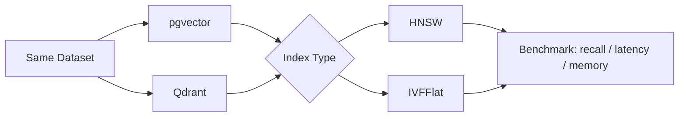

✅ **Production note:** pull your actual VectorLens benchmark methodology into this folder's `NOTES.md` — this is a week to document, not rediscover.

📁 `03_vector_db_deep_dive/`

---

### Week 4 — Grammar-Constrained Structured Extraction
**Pattern:** Pattern 2 — Grammar · **Level:** Beginner

🎯 **Problem:** Downstream systems need valid JSON/schema-conformant output every time, not "usually parses."

📚 **Resources:**
- [Instructor](https://python.useinstructor.com/) — Pydantic-based structured outputs
- [Outlines](https://github.com/dottxt-ai/outlines) — grammar/regex-constrained generation at the token level
- [Anthropic: Tool use](https://docs.claude.com/en/docs/build-with-claude/tool-use) — schema-constrained output via tool-call format

🔨 **Steps:**
1. Take retrieved chunks from Week 1's pipeline and define a strict output schema (Pydantic or JSON Schema)
2. Implement it two ways: constrained decoding (Outlines) and schema-guided tool-calling (Instructor or native tool use)
3. Force malformed edge cases (ambiguous source data) and observe failure modes in both approaches
4. Add a validate → repair → retry loop for the rare failure
5. Benchmark latency overhead of constrained decoding vs the retry-based approach

🧩 **Architecture:**
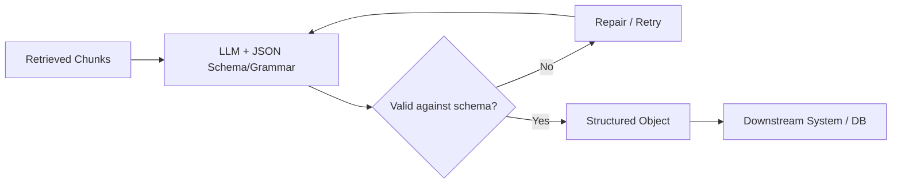

✅ **Production note:** constrained decoding trades a small latency tax for a *guarantee* — that tradeoff is usually worth writing down explicitly for whoever inherits this code.

📁 `04_structured_extraction/`

---

### Week 5 — Prompt & Semantic Caching for RAG
**Pattern:** Pattern 25 — Prompt Caching · **Level:** Beginner

🎯 **Problem:** Repeated or near-duplicate queries (common in any real product) recompute the same retrieval + generation every time, burning cost and latency for nothing.

📚 **Resources:**
- [Anthropic: Prompt caching](https://docs.claude.com/en/docs/build-with-claude/prompt-caching) — server-side prefix caching
- [GPTCache](https://github.com/zilliztech/GPTCache) — semantic response caching

🔨 **Steps:**
1. Add prefix caching for your system prompt + retrieved context using native API prompt caching
2. Add a separate semantic cache layer: embed incoming queries, check similarity against a cache of past query→answer pairs
3. Define a cache invalidation policy (TTL, or invalidate on source-document update)
4. Measure cost and latency before/after on a realistic query distribution (some exact repeats, some near-duplicates, some novel)
5. Document the hit-rate vs staleness-risk tradeoff you chose

🧩 **Architecture:**
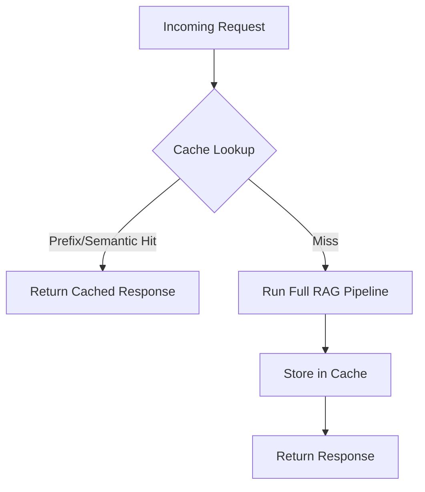

✅ **Production note:** semantic caching is a correctness risk, not just a cost optimization — a too-loose similarity threshold silently serves wrong answers. Log every cache hit's similarity score.

📁 `05_prompt_caching_for_rag/`

---

## Phase 2 — RAG Intermediate (Weeks 6–10)

### Week 6 — Metadata Filtering & Indexing at Scale
**Pattern:** Pattern 8 — Indexing at Scale · **Level:** Intermediate

🎯 **Problem:** A knowledge base with outdated, contradictory, or access-restricted content returns confidently wrong answers unless retrieval is filtered before it's ranked.

📚 **Resources:**
- [LlamaIndex: Metadata filtering](https://docs.llamaindex.ai/)
- [Weaviate: Filtered vector search](https://weaviate.io/developers/weaviate)

🔨 **Steps:**
1. Tag every chunk with metadata: source, published date, version/supersession flag, access tier
2. Implement filtered search: metadata pre-filter → vector search (not vector search → post-filter, which wastes the top-k budget)
3. Add a "supersedes" relationship so outdated docs get excluded automatically when a newer version exists
4. Add reranking on the filtered result set (bridges into Week 8)
5. Test with a deliberately contradictory corpus (same fact stated differently in an old vs new doc) and confirm the right one wins

🧩 **Architecture:**
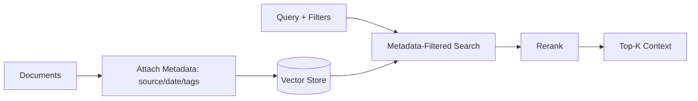

✅ **Production note:** pre-filtering vs post-filtering is the detail that breaks recall silently at scale — verify which one your vector DB actually does by default.

📁 `06_indexing_at_scale/`

---

### Week 7 — HyDE & Query Expansion
**Pattern:** Pattern 9 — Index-aware Retrieval · **Level:** Intermediate

🎯 **Problem:** Short, jargon-light, or ambiguous user queries don't lexically or semantically resemble the document chunks that answer them.

📚 **Resources:**
- [HyDE paper — Precise Zero-Shot Dense Retrieval without Relevance Labels](https://arxiv.org/abs/2212.10496)
- [LlamaIndex: Query transformations](https://docs.llamaindex.ai/)

🔨 **Steps:**
1. Implement HyDE: have the LLM write a hypothetical answer to the query, embed *that*, and search with it instead of the raw query embedding
2. Implement query expansion: generate 3–5 paraphrases/sub-queries and search with all of them, merging results
3. Add hybrid search (BM25 + dense) as a complementary axis
4. Build an eval set specifically of "hard" queries (jargon mismatch, vague phrasing) separate from Week 1's easy set
5. Compare recall on hard queries: raw query vs HyDE vs expansion vs hybrid

🧩 **Architecture:**
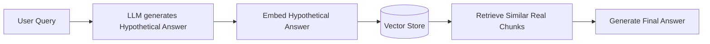

✅ **Production note:** HyDE adds an extra LLM call before retrieval even starts — measure the latency cost against the recall gain, it's not a free win for every query distribution.

📁 `07_hyde_query_expansion/`

---

### Week 8 — Cross-Encoder Reranking
**Pattern:** Pattern 10 — Node Postprocessing · **Level:** Intermediate

🎯 **Problem:** Vector search top-k is a recall tool, not a precision tool — the most relevant chunk is often not ranked first.

📚 **Resources:**
- [Cohere Rerank docs](https://docs.cohere.com/docs/rerank)
- [Sentence-Transformers: Cross-Encoders](https://www.sbert.net/examples/applications/cross-encoder/README.html)

🔨 **Steps:**
1. Retrieve a wide net (top-50) with the fast bi-encoder from earlier weeks
2. Rerank with a cross-encoder (Cohere Rerank API or a local `ms-marco` cross-encoder model)
3. Compare answer quality and citation accuracy: top-5 from bi-encoder alone vs top-5 after rerank
4. Measure the added latency and decide the top-k → rerank-k tradeoff for your latency budget
5. Add disambiguation: when two chunks describe similarly-named but different entities, confirm reranking actually separates them

🧩 **Architecture:**
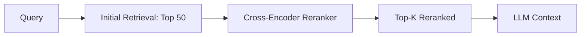

✅ **Production note:** reranking is usually the highest ROI-per-hour-of-work change you can make to an existing RAG system — a good week to have a strong before/after benchmark screenshot for your portfolio.

📁 `08_reranking_node_postprocessing/`

---

### Week 9 — Trustworthy Generation: Citations & Confidence
**Pattern:** Pattern 11 — Trustworthy Generation · **Level:** Intermediate

🎯 **Problem:** There's no way to fully eliminate RAG errors — the system needs to communicate uncertainty instead of asserting everything with the same confidence.

📚 **Resources:**
- ["Lost in the Middle" paper](https://arxiv.org/abs/2307.03172) — context position affects what the model actually uses
- [RAGAS documentation](https://docs.ragas.io/) — faithfulness/relevance metrics you'll reuse in Week 27

🔨 **Steps:**
1. Add inline citations that map generated claims back to specific source chunks
2. Build an out-of-domain detector: if retrieval scores fall below a threshold, refuse to answer instead of guessing
3. Reorder context using the "lost in the middle" finding — put the most important chunk first or last, not buried
4. Add a UX layer: show confidence/source count alongside the answer, not just the text
5. Test with questions that have no answer in the corpus and confirm the system says so instead of hallucinating

🧩 **Architecture:**
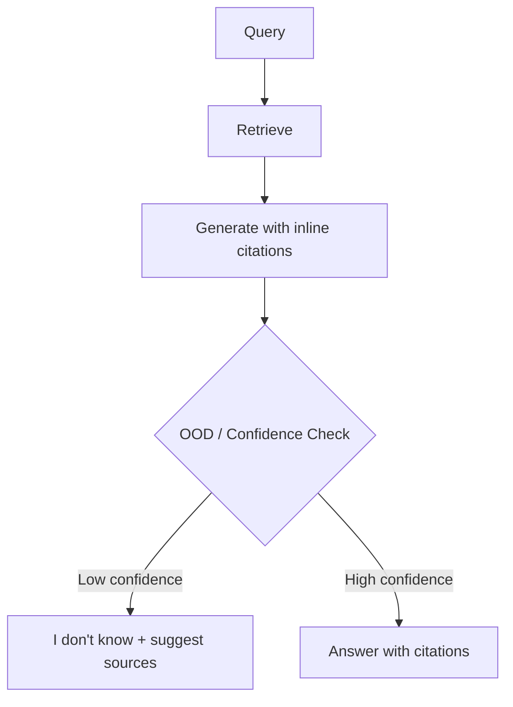

✅ **Production note:** refusing to answer is a UX decision, not just a technical one — a visible "not confident" beats a fluent wrong answer, but only if the product surface actually shows it.

📁 `09_trustworthy_generation/`

---

### Week 10 — Corrective RAG (CRAG)
**Pattern:** Pattern 11 + Pattern 18 — Trustworthy Generation + Reflection · **Level:** Intermediate/Advanced

This is the exact example you described — a self-correcting RAG system built for production, not a demo.

🎯 **Problem:** Static top-k retrieval has no way to recover when the retrieved documents are actually irrelevant or only partially relevant — it just generates from bad context anyway.

📚 **Resources:**
- [Corrective Retrieval Augmented Generation (CRAG) paper](https://arxiv.org/abs/2401.15884)
- [LangGraph](https://langchain-ai.github.io/langgraph/) — the CRAG control-flow (branch/loop/retry) maps naturally onto a graph

🔨 **Steps:**
1. Add a lightweight relevance grader: an LLM call that scores each retrieved chunk as Correct / Ambiguous / Incorrect against the query
2. **Correct** → use the retrieved docs as-is (fast path, most queries)
3. **Ambiguous** → refine the query (decompose or rewrite) and re-retrieve, optionally supplementing with web search
4. **Incorrect** → discard retrieval entirely and fall back to web search or a "no answer in knowledge base" response
5. Implement this as an explicit state graph (LangGraph is a natural fit) so the branching is visible and testable, not buried in nested if/else
6. Build an eval set with intentionally poor-match queries to force each of the three branches and confirm each one is exercised correctly

🧩 **Architecture:**
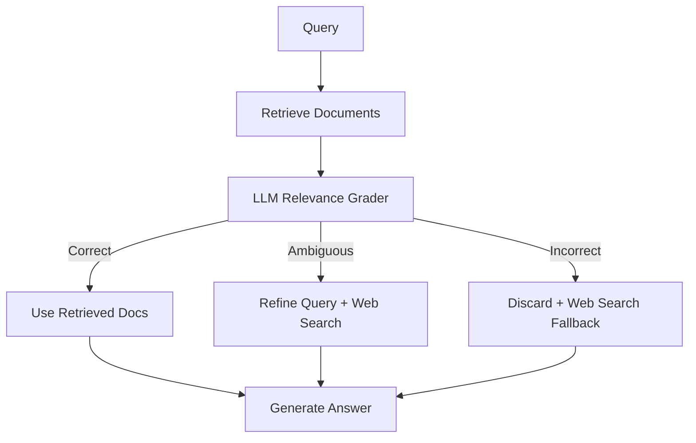

✅ **Production note:** the grading call adds latency to *every* query for a correction that's only needed on some — cache/short-circuit the fast "Correct" path aggressively, and track what fraction of real traffic actually needs each branch so you can tune the grader's threshold with data instead of guessing.

📁 `10_corrective_rag/`

---

## Phase 3 — RAG Advanced / Expert (Weeks 11–14)

### Week 11 — GraphRAG on Your Own Corpus
**Pattern:** Pattern 9 (extended) — GraphRAG · **Level:** Advanced

🎯 **Problem:** Pure vector similarity can't answer questions that require connecting facts across documents ("how are X and Y related") — it can only answer questions that live inside one chunk.

📚 **Resources:**
- [Microsoft GraphRAG documentation](https://microsoft.github.io/graphrag/)
- [GraphRAG paper — From Local to Global](https://arxiv.org/abs/2404.16130)
- [Neo4j GraphRAG ecosystem](https://neo4j.com/labs/genai-ecosystem/graphrag/) — directly relevant given Documind already runs on Neo4j

🔨 **Steps:**
1. Run entity + relationship extraction over your corpus with an LLM to build a knowledge graph
2. Load it into Neo4j (reuse your Documind schema patterns as a starting point, but keep this folder standalone)
3. Add community detection + hierarchical summarization (Microsoft GraphRAG's core contribution) for "global" questions
4. Implement both query modes: local search (entity-centric) and global search (theme/summary-centric) and show when each wins
5. Compare against a pure-vector baseline on genuinely multi-hop, relationship questions — this contrast is the whole point of the folder

🧩 **Architecture:**
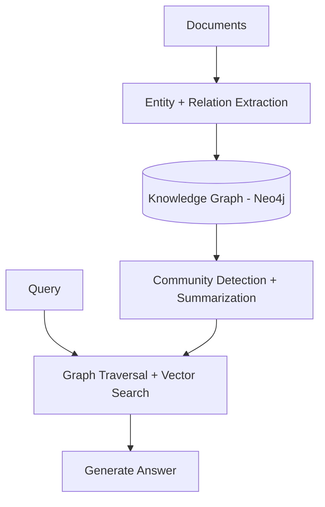

✅ **Production note:** GraphRAG indexing is expensive (many LLM calls per document) — budget for it explicitly and note the cost-per-document in `NOTES.md`; this is usually the first question a client asks.

📁 `11_graphrag/`

---

### Week 12 — Agentic Deep Search (Multi-Hop)
**Pattern:** Pattern 12 — Deep Search · **Level:** Advanced

🎯 **Problem:** Complex questions need several rounds of search-read-reason before there's enough evidence to answer — a single retrieval pass isn't enough, and the context window can't hold "search everything at once."

📚 **Resources:**
- [IRCoT — Interleaving Retrieval with Chain-of-Thought](https://arxiv.org/abs/2212.10509)
- Your own Week 16 ReAct loop is the execution substrate for this pattern — build this one after Phase 4 if you want the dependency in the right order, or treat this week as the RAG-flavored preview of it

🔨 **Steps:**
1. Take a genuinely multi-hop question ("what changed between the two most recent versions of X, and why") and decompose it into sub-questions
2. Loop: search → read → reason → decide if there's enough evidence yet → repeat or synthesize
3. Track evidence explicitly across iterations (don't rely on it staying implicitly in context — log a running evidence list)
4. Cap iterations with a hard budget and a graceful "here's what I found, here's what's still uncertain" fallback
5. Compare against single-pass RAG on the same question set to show the delta

🧩 **Architecture:**
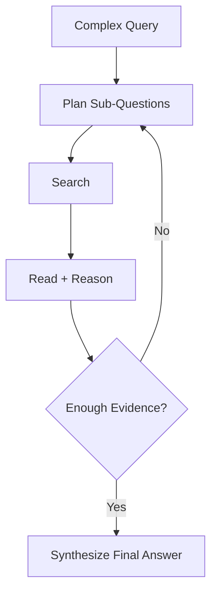

✅ **Production note:** unbounded iteration loops are a cost and latency landmine — put a hard iteration cap and a token budget in from day one, not as an afterthought.

📁 `12_agentic_deep_search/`

---

### Week 13 — Self-RAG
**Pattern:** Pattern 31 — Self-Check · **Level:** Expert

🎯 **Problem:** Retrieving on every query wastes cost on questions the model can answer confidently on its own, and generating without checking whether retrieved context actually supports the claim lets hallucination slip through even with RAG in place.

📚 **Resources:**
- [Self-RAG paper — Learning to Retrieve, Generate, and Critique](https://arxiv.org/abs/2310.11511)

🔨 **Steps:**
1. Add a "retrieval needed?" gate before searching at all — let the model decide when it's confident enough to skip retrieval
2. When retrieval happens, generate with explicit self-critique: is this chunk relevant? Is the claim actually supported by it?
3. If the critique fails, retrieve again with a refined query (bounded retries)
4. Compare token/cost usage against always-retrieve RAG on a mixed query set (some needing retrieval, some not)
5. Spot-check a sample of "skipped retrieval" answers by hand to confirm the gate isn't overconfident

🧩 **Architecture:**
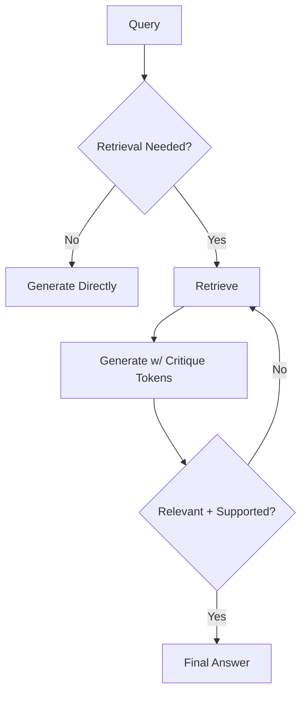

✅ **Production note:** this pattern trades a more complex pipeline for real cost savings on easy queries — only worth it if your traffic actually has a meaningful easy/hard mix; measure that mix before committing to the added complexity.

📁 `13_self_rag/`

---

### Week 14 — Capstone: Production RAG-as-a-Service
**Pattern:** Assembled from Weeks 1–13 · **Level:** Expert

🎯 **Problem:** Individually correct components (cache, rerank, guardrails, citations) still need to be wired together into one coherent, observable service — that integration is its own skill.

📚 **Resources:**
- [FastAPI documentation](https://fastapi.tiangolo.com/)
- Reuse RAGAS from Week 9 for a regression eval suite

🔨 **Steps:**
1. Wrap Weeks 5, 8, 9, and 10 (caching, reranking, trustworthy generation, corrective RAG) behind one FastAPI service
2. Add request logging: query, retrieved chunk IDs, relevance scores, cache hit/miss, latency breakdown per stage
3. Add a `/health` and `/eval` endpoint — the eval endpoint runs your RAGAS suite on demand and returns faithfulness/relevance scores
4. Containerize with Docker Compose (vector DB + API + cache in one stack, same shape as your Documind setup)
5. Load-test it lightly here as a preview of Week 26's deeper treatment

🧩 **Architecture:**
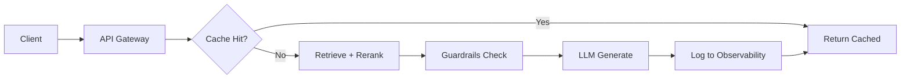

✅ **Production note:** this is the folder to link directly in Upwork proposals — it demonstrates the full pipeline end-to-end, not just one pattern in isolation.

📁 `14_capstone_rag_api/`

---

## Phase 4 — Agents (Weeks 15–20)

### Week 15 — Tool Calling Fundamentals
**Pattern:** Pattern 21 — Tool Calling · **Level:** Intermediate

🎯 **Problem:** An LLM that can only describe steps isn't useful for anything that requires actually doing them — calculations, live data, database writes.

📚 **Resources:**
- [Anthropic: Tool use](https://docs.claude.com/en/docs/build-with-claude/tool-use)
- [OpenAI: Function calling](https://platform.openai.com/docs/guides/function-calling)

🔨 **Steps:**
1. Define 2–3 real tools with strict JSON schemas (e.g., a calculator, a database lookup, an API call)
2. Implement the full loop: model emits a tool call → your code executes it → result goes back to the model → model incorporates it
3. Handle the failure cases explicitly: tool errors, malformed arguments, tools that time out
4. Add parallel tool calling where the model can request multiple independent tools in one turn
5. Test with a query that requires chaining two tools (output of one feeds into the other)

🧩 **Architecture:**
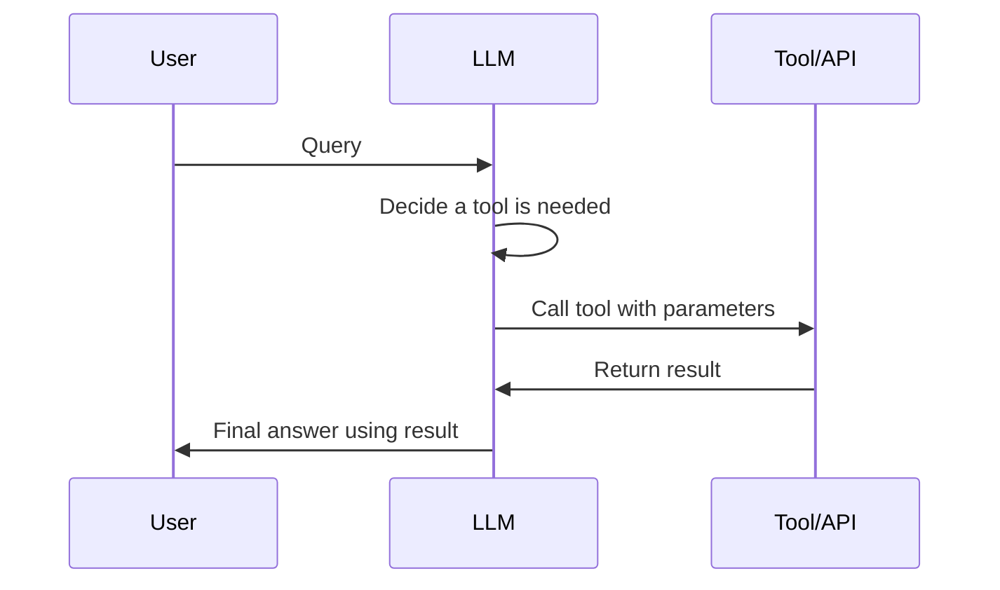

✅ **Production note:** validate tool arguments server-side before execution regardless of schema constraints on generation — never trust the model's output as the only safety layer, especially for anything that writes data.

📁 `15_tool_calling_fundamentals/`

---

### Week 16 — Chain-of-Thought & ReAct Agent
**Pattern:** Pattern 13 — Chain of Thought · **Level:** Intermediate

🎯 **Problem:** Multi-step reasoning tasks fail when the model jumps straight to an answer instead of working through intermediate steps — and tool-using agents need reasoning interleaved with action, not just action.

📚 **Resources:**
- [Chain-of-Thought Prompting paper](https://arxiv.org/abs/2201.11903)
- [ReAct — Synergizing Reasoning and Acting paper](https://arxiv.org/abs/2210.03629)

🔨 **Steps:**
1. Build a baseline CoT prompt for a multi-step reasoning task and confirm it beats direct-answer prompting on your eval set
2. Extend to full ReAct: explicit Thought → Action → Observation loop, using the tools from Week 15
3. Log the full trace (every thought/action/observation) — this is essential for debugging agent failures later
4. Add a max-step cap and a "stuck" detector (repeating the same action without progress)
5. Compare trace quality and success rate against the Week 15 tool-calling loop without explicit reasoning steps

🧩 **Architecture:**
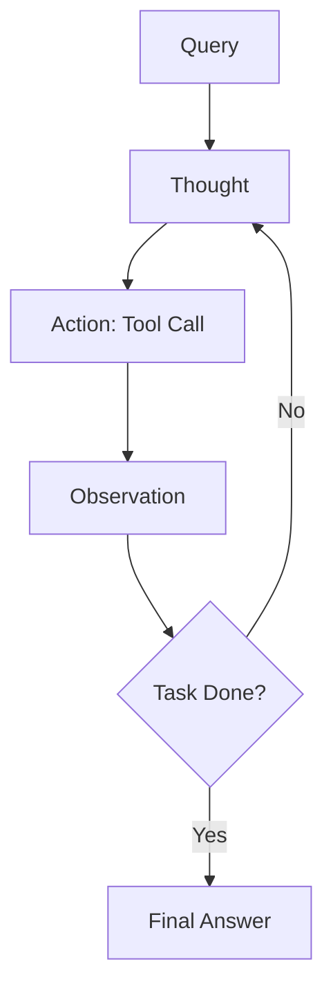

✅ **Production note:** full trace logging here is what makes Week 26's degradation testing and Week 27's LLM-as-judge eval possible later — build the logging discipline now, not retroactively.

📁 `16_cot_react_agent/`

---

### Week 17 — Tree of Thoughts Planning Agent
**Pattern:** Pattern 14 — Tree of Thoughts · **Level:** Advanced

🎯 **Problem:** Some problems (planning, strategic tasks, puzzles) don't have one correct reasoning path — a linear CoT chain commits early and can't backtrack from a bad branch.

📚 **Resources:**
- [Tree of Thoughts paper](https://arxiv.org/abs/2305.10601)

🔨 **Steps:**
1. Pick a task with a real branching solution space (a planning problem, a constrained scheduling task — not a rote-recall question, ToT is wasted on those)
2. Generate multiple candidate "thoughts" (partial solutions) at each step, not just one
3. Implement an evaluator that scores each branch's promise
4. Add search: expand the best-scoring branch(es), backtrack from dead ends, allow limited breadth
5. Compare final solution quality against plain CoT on the same task, and note the extra token cost

🧩 **Architecture:**
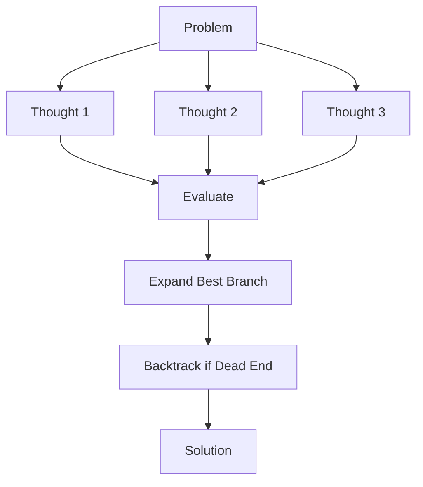

✅ **Production note:** ToT's token cost scales fast with branching factor and depth — this pattern earns its keep only on tasks where a wrong linear answer is expensive; don't reach for it by default.

📁 `17_tree_of_thoughts/`

---

### Week 18 — Reflection: Self-Correcting Loops
**Pattern:** Pattern 18 — Reflection · **Level:** Advanced

🎯 **Problem:** A first-draft answer is often good but not great, and the model has no mechanism to critique and improve its own output unless you build one.

📚 **Resources:**
- [Reflexion paper](https://arxiv.org/abs/2303.11366)
- [Self-Refine paper](https://arxiv.org/abs/2303.17651)

🔨 **Steps:**
1. Generate a first-draft answer to a non-trivial task (code generation is a good testbed — errors are objectively checkable)
2. Add a critic pass: a separate prompt (or the same model, role-switched) reviews the draft against explicit criteria
3. Feed the critique back and regenerate, capped at 2–3 rounds
4. Track whether each round actually improves the output (measure it, don't assume it) — reflection can plateau or even regress past a certain point
5. Compare final quality and total cost against a single-shot generation with a longer, more detailed initial prompt instead

🧩 **Architecture:**
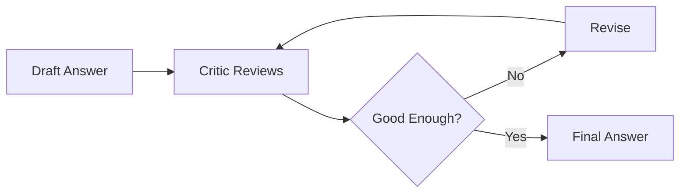

✅ **Production note:** reflection roughly multiplies your cost by the number of rounds — measure the marginal quality gain per round and cut the loop where it stops paying for itself.

📁 `18_reflection_agent/`

---

### Week 19 — Code-Execution Agent
**Pattern:** Pattern 22 — Code Execution · **Level:** Advanced

🎯 **Problem:** Some tasks (data analysis, precise calculation, chart generation) are far more reliable done in code than reasoned about in natural language.

📚 **Resources:**
- [E2B — sandboxed code execution](https://e2b.dev/docs)
- [Anthropic: Code execution tool](https://docs.claude.com/en/docs/agents-and-tools/tool-use/code-execution-tool)

🔨 **Steps:**
1. Set up a sandboxed execution environment (E2B or a locked-down local Docker container — never execute model-generated code unsandboxed)
2. Give the model a data/analysis task, let it write code, execute it, and return results
3. Handle the error loop: execution fails → error goes back to the model → model fixes and retries
4. Add output limits (timeout, memory cap, no network unless explicitly needed) as hard sandbox constraints, not model instructions
5. Test with a task that requires iteration (the first code attempt has a bug) to confirm the repair loop actually works

🧩 **Architecture:**
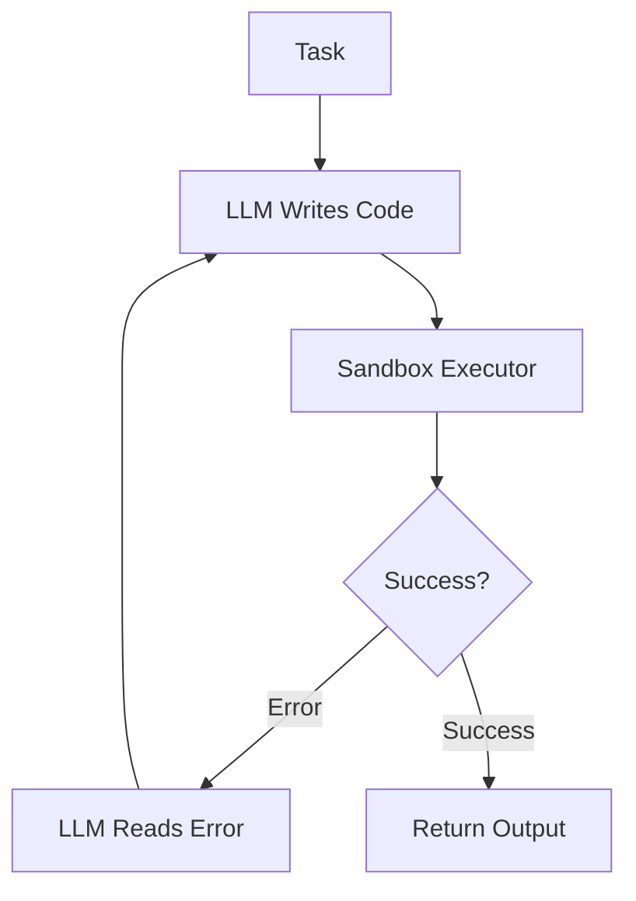

✅ **Production note:** sandbox isolation is a security requirement, not a nice-to-have — treat every code-execution agent as if the generated code were untrusted, because functionally it is.

📁 `19_code_execution_agent/`

---

### Week 20 — Multi-Agent Collaboration + Long-Term Memory
**Pattern:** Pattern 23 + Pattern 28 — Multi-agent Collaboration + Long-Term Memory · **Level:** Advanced

🎯 **Problem:** Complex tasks benefit from specialized agents (researcher, coder, reviewer) instead of one generalist doing everything, and any agent that runs across sessions needs memory that survives past the context window.

📚 **Resources:**
- [LangGraph — multi-agent docs](https://langchain-ai.github.io/langgraph/) — largest 2026 production footprint for graph-based multi-agent orchestration; start here for anything you intend to actually ship
- [CrewAI docs](https://docs.crewai.com/) — faster to prototype role-based crews if you want to compare approaches
- [Mem0](https://docs.mem0.ai/) — quick to set up for session-persistent user memory
- [Letta (formerly MemGPT)](https://docs.letta.com/) — closer fit for long-running autonomous agents with self-editing memory

🔨 **Steps:**
1. Design an orchestrator + 2–3 specialist agents (e.g., Researcher, Coder, Reviewer) with a clear handoff contract between them
2. Implement with LangGraph as a directed graph — explicit state, explicit transitions, not an implicit conversation
3. Add a memory layer (Mem0 or Letta) so facts learned in one session are available in the next, not just within one context window
4. Add an aggregation/synthesis step where the orchestrator combines specialist outputs into one coherent result
5. Test a task that genuinely benefits from specialization (each agent clearly outperforms a generalist on its slice) — otherwise the multi-agent overhead isn't justified

🧩 **Architecture:**
```mermaid
flowchart TD
    A[Orchestrator Agent] --> B[Researcher Agent]
    A --> C[Coder Agent]
    A --> D[Reviewer Agent]
    B --> E[Aggregate Results]
    C --> E
    D --> E
    E --> F[(Long-Term Memory Store)]
    F -.persists across sessions.-> A
```

✅ **Production note:** multi-agent systems fail in more, harder-to-debug ways than single agents — the eval pipeline and failure-recovery logic matter more than which framework you pick; don't skip Week 27's LLM-as-judge work when this ships.

📁 `20_multi_agent_and_memory/`

---

## Phase 5 — MCP (Model Context Protocol) (Weeks 21–22)

### Week 21 — Build an MCP Server
**Pattern:** Ecosystem Pattern — Model Context Protocol · **Level:** Advanced

🎯 **Problem:** Every new client integration (chat UI, IDE, custom agent) traditionally means rewriting your tool/data-access layer for that client's specific tool-calling format — MCP standardizes this into "build once, connect anywhere."

📚 **Resources:**
- [Model Context Protocol documentation](https://modelcontextprotocol.io/)
- [Build an MCP server — official guide](https://modelcontextprotocol.io/docs/develop/build-server)
- [MCP Python SDK](https://github.com/modelcontextprotocol/python-sdk)

🔨 **Steps:**
1. Pick something worth exposing — your Week 14 RAG API is a natural choice
2. Wrap it as an MCP server exposing it as a **tool** (query), a **resource** (browsable knowledge base entries), and optionally a **prompt** (a pre-built query template)
3. Run it locally over stdio and connect it from an MCP-compatible client (Claude Desktop or another MCP host) to confirm it works outside your own test harness
4. Add auth/scoping if the underlying data has any access boundaries — don't expose more than the client should see
5. Document the server's tool/resource contract the way you'd document a public API, because that's what it now is

🧩 **Architecture:**
```mermaid
flowchart LR
    A[Your RAG API / Data] --> B[MCP Server]
    B --> C[Tools]
    B --> D[Resources]
    B --> E[Prompts]
    B --> F[MCP Protocol: stdio / HTTP+SSE]
    F --> G[Any MCP Client: Claude Desktop, IDE, custom agent]
```

✅ **Production note:** MCP is now supported across essentially every major agent framework as the standard tool-interop layer — a server built this week is directly reusable in Week 20's multi-agent system and Week 30's capstone, not throwaway practice.

📁 `21_mcp_server/`

---

### Week 22 — Multi-Server MCP Client Agent
**Pattern:** Ecosystem Pattern — Model Context Protocol · **Level:** Advanced

🎯 **Problem:** Real agents need more than one capability (your own data, the filesystem, a database, a web tool) — the client side of MCP is what lets one agent compose capabilities from multiple independent servers.

📚 **Resources:**
- [MCP documentation — client concepts](https://modelcontextprotocol.io/docs)
- [MCP servers reference repo](https://github.com/modelcontextprotocol/servers) — pre-built servers to connect alongside your own

🔨 **Steps:**
1. Build (or reuse a framework's) MCP client that can connect to multiple servers simultaneously
2. Connect your Week 21 server plus 1–2 reference servers (filesystem, a public API server)
3. Let the agent's LLM decide which server's tools to call based on the query — no hardcoded routing
4. Handle a server going down or timing out gracefully (the agent should degrade, not crash)
5. Compare this against a monolithic single-codebase tool-calling agent doing the same tasks — the point is showing what the standardization buys you

🧩 **Architecture:**
```mermaid
flowchart TD
    A[Agent] --> B[MCP Client]
    B --> C[MCP Server: Filesystem]
    B --> D[MCP Server: Your RAG API]
    B --> E[MCP Server: Database]
    C --> F[Aggregated Context]
    D --> F
    E --> F
    F --> G[LLM Response]
```

✅ **Production note:** this pattern is what turns individual weeks 1–20 into a composable toolkit instead of 20 disconnected demos — worth calling out explicitly in your portfolio narrative.

📁 `22_mcp_multi_tool_agent/`

---

## Phase 6 — Serving, Inference & LLMOps (Weeks 23–27)

*You already have a dedicated vLLM/LiteLLM/serving self-study track covering these tools in depth. This phase isn't re-teaching them — it's the "ship one clean, documented, portfolio-ready use case per week" version of that deeper knowledge.*

### Week 23 — Self-Hosted Serving with vLLM
**Pattern:** Pattern 26 — Inference Optimization · **Level:** Expert

🎯 **Problem:** API-based inference has per-token cost and rate limits that don't work for high-throughput or latency-sensitive production workloads — self-hosting trades ops complexity for control.

📚 **Resources:**
- [vLLM documentation](https://docs.vllm.ai/)
- [PagedAttention paper](https://arxiv.org/abs/2309.06180)

🔨 **Steps:**
1. Serve an open-weight model with vLLM, exposing an OpenAI-compatible endpoint
2. Point your Week 14 RAG API at it instead of a hosted provider and confirm functional parity
3. Tune continuous batching settings and measure throughput under concurrent load
4. Compare cost-per-1K-tokens: self-hosted (GPU rental + amortized setup time) vs API provider, at your actual traffic volume
5. Document at what request volume self-hosting actually wins — this is usually the real deliverable, not the serving setup itself

🧩 **Architecture:**
```mermaid
flowchart LR
    A[Incoming Requests] --> B[Request Queue]
    B --> C[Continuous Batching Scheduler]
    C --> D[PagedAttention KV Cache]
    D --> E[GPU Workers]
    E --> F[Streamed Tokens]
```

✅ **Production note:** the crossover point where self-hosting beats API pricing is a real number you should be able to state — that's the kind of specific, defensible claim that's worth more in a proposal than "I know vLLM."

📁 `23_vllm_serving/`

---

### Week 24 — Small Models: Quantization & Speculative Decoding
**Pattern:** Pattern 24 — Small Language Model (SLM) · **Level:** Expert

🎯 **Problem:** A large general model is often overkill (and too slow/expensive) for a narrow, well-defined task.

📚 **Resources:**
- [AWQ paper](https://arxiv.org/abs/2306.00978)
- [GPTQ paper](https://arxiv.org/abs/2210.17323)
- [Speculative decoding paper](https://arxiv.org/abs/2211.17192)

🔨 **Steps:**
1. Pick a narrow task from an earlier week (the Week 4 structured extraction task is a good fit) and quantize a smaller model for it (AWQ or GPTQ, INT4/INT8)
2. Benchmark quality degradation vs the full-precision model on your task's own eval set — not a generic benchmark
3. Set up speculative decoding: a small draft model proposes tokens, the larger target model verifies them in batches
4. Measure throughput gains from speculative decoding on your actual hardware
5. Write up the quality/cost/latency triangle for this specific task — the tradeoff is task-dependent, so a generic answer isn't useful

🧩 **Architecture:**
```mermaid
flowchart TD
    A[Large Teacher Model] --> B[Distillation]
    A --> C[Quantization: AWQ/GPTQ/INT4]
    B --> D[Small Student Model]
    C --> D
    D --> E[Deploy: edge / low-cost GPU]
    F[Draft Model] -.speculative decoding.-> G[Target Model Verifies]
```

✅ **Production note:** quantization quality loss is highly task-dependent — always validate on your own eval set, never trust a generic "X% quality retained" number from a model card for your specific use case.

📁 `24_slm_quantization_speculative/`

---

### Week 25 — LiteLLM Gateway
**Pattern:** Ecosystem Pattern — LiteLLM · **Level:** Expert

🎯 **Problem:** Hardcoding one provider's SDK throughout a codebase makes switching models, adding fallback, or tracking spend across providers painful — you want a single interface in front of everything.

📚 **Resources:**
- [LiteLLM documentation](https://docs.litellm.ai/)
- [LiteLLM Proxy quick start](https://docs.litellm.ai/docs/proxy/quick_start)

🔨 **Steps:**
1. Stand up the LiteLLM proxy in front of OpenRouter, a direct Anthropic key, and your Week 23 self-hosted vLLM endpoint — one config, three backends
2. Point every earlier week's code at the LiteLLM endpoint instead of calling providers directly (this is the payoff week — everything upstream gets simpler)
3. Configure fallback: if the primary model errors or times out, automatically retry on a secondary
4. Add virtual keys and per-project spend tracking/budgets
5. Load-test the proxy itself to confirm it's not a new bottleneck

🧩 **Architecture:**
```mermaid
flowchart LR
    A[Your App] --> B[LiteLLM Proxy]
    B --> C{Router: cost/latency/fallback}
    C --> D[OpenRouter]
    C --> E[Anthropic Direct]
    C --> F[Self-hosted vLLM]
    B --> G[Cost + Usage Logging]
```

✅ **Production note:** LiteLLM's proxy can also front MCP tool calls — worth connecting explicitly back to Phase 5 if you want one gateway mediating both model calls and tool access.

📁 `25_litellm_gateway/`

---

### Week 26 — Load & Degradation Testing
**Pattern:** Pattern 27 — Degradation Testing · **Level:** Expert

🎯 **Problem:** A system that works in a demo can fall over under real concurrent load in ways that are invisible until you specifically go looking for them.

📚 **Resources:**
- [k6 load testing docs](https://k6.io/docs/)
- [vLLM benchmarking docs](https://docs.vllm.ai/)

🔨 **Steps:**
1. Instrument your Week 14 or Week 23 service to report Time-to-First-Token (TTFT), End-to-End Request Latency (EERL), and Tokens-per-Second (TPS)
2. Write k6 (or similar) load test scripts that ramp concurrent users up gradually
3. Find the breaking point: at what concurrency does p99 latency or error rate become unacceptable
4. Test targeted interventions (increase batch size, add a cache layer, add a fallback model) and measure which actually moves the needle
5. Build a small dashboard (even a simple one) that shows these metrics over a test run

🧩 **Architecture:**
```mermaid
flowchart LR
    A[Load Generator: k6] --> B[Target LLM Service]
    B --> C[Metrics Collector]
    C --> D[TTFT]
    C --> E[EERL]
    C --> F[TPS]
    D --> G[Dashboard + Alerts]
    E --> G
    F --> G
```

✅ **Production note:** "it works" and "it works at your expected concurrency" are different claims — this folder is where you get to make the second one with actual numbers behind it.

📁 `26_degradation_testing/`

---

### Week 27 — LLM-as-Judge + Automated Prompt Optimization
**Pattern:** Pattern 17 + Pattern 20 — LLM-as-Judge + Prompt Optimization · **Level:** Expert

🎯 **Problem:** Open-ended GenAI outputs don't have a single ground truth to check against, so "did this get better" needs a structured, repeatable evaluation method — and prompts drift out of tune every time a dependency (model version, data) changes.

📚 **Resources:**
- ["Judging LLM-as-a-Judge" paper](https://arxiv.org/abs/2306.05685)
- [DSPy](https://dspy.ai/) — programmatic prompt optimization against a metric
- [RAGAS](https://docs.ragas.io/) — reuse from Week 9/14 for RAG-specific metrics

🔨 **Steps:**
1. Define a rubric for one of your earlier use cases (start with something checkable, like Week 4's structured extraction or Week 10's CRAG)
2. Build an LLM-as-judge pipeline that scores outputs against the rubric, multi-dimensionally (not just pass/fail)
3. Validate the judge itself against a small hand-labeled set — confirm it agrees with your own judgment before trusting it
4. Wire the judge's scores into DSPy as an optimization metric and let it search for a better prompt automatically
5. Compare the DSPy-optimized prompt against your hand-written one on a held-out eval set

🧩 **Architecture:**
```mermaid
flowchart TD
    A[Candidate Outputs] --> B[Judge LLM + Rubric]
    B --> C[Scores]
    C --> D[DSPy Optimizer]
    D --> E[Updated Prompt]
    E --> F[Re-run Pipeline]
    F --> A
```

✅ **Production note:** an unvalidated judge is just a second unreliable model grading a first one — the hand-labeled agreement check in step 3 isn't optional, it's the step that makes the rest of this trustworthy.

📁 `27_llm_as_judge_prompt_opt/`

---

## Phase 7 — Safety, Fine-Tuning & Capstone (Weeks 28–30)

### Week 28 — Guardrails: Input, Output & Tool-Call Safety Rails
**Pattern:** Pattern 32 — Guardrails · **Level:** Advanced

🎯 **Problem:** Once a system takes untrusted input, calls tools, or retrieves from documents you don't fully control, it needs safety checks at every boundary — not just a single output filter, which is a 2023-era approach at this point.

📚 **Resources:**
- [NeMo Guardrails](https://github.com/NVIDIA/NeMo-Guardrails) — Colang-based dialogue/policy rails, strong for complex conversational boundaries
- [Guardrails AI](https://www.guardrailsai.com/) — schema-based validators, strong when structured output correctness is the main risk
- [Llama Guard](https://huggingface.co/meta-llama/Llama-Guard-3-8B) — a dedicated classifier for input/output content moderation

🔨 **Steps:**
1. Map the four real placement points for this system: input (before the model sees it), retrieval (before chunks enter the prompt), output (before the response returns), and tool-call (before arguments execute) — a filter on only one of these isn't a complete guardrails layer
2. Implement input rails: prompt injection and PII detection on incoming queries
3. Implement retrieval rails: scan retrieved chunks for injected instructions before they enter the prompt (relevant if your RAG corpus includes any untrusted or user-submitted documents)
4. Implement output rails: toxicity, hallucination, and PII checks before returning a response
5. Implement tool-call rails: validate tool arguments against expected ranges/patterns before execution (ties back to Week 15's server-side validation)
6. Deliberately test with adversarial inputs (prompt injection attempts, jailbreak patterns) and measure both false negatives (missed attacks) and false positives (blocked legitimate requests) — track both, since over-blocking is also a failure mode

🧩 **Architecture:**
```mermaid
flowchart LR
    A[User Input] --> B[Input Rail: injection/PII]
    B --> C[Retrieval Rail: scan chunks]
    C --> D[LLM / Tool Calls]
    D --> E[Output Rail: toxicity/hallucination/PII]
    E --> F{Pass?}
    F -->|Yes| G[Return Response]
    F -->|No| H[Block / Rewrite]
```

✅ **Production note:** report both false-negative and false-positive rates on your adversarial test set, not just "it caught the attacks" — a guardrail that blocks 30% of legitimate requests isn't shippable even if it's perfectly safe.

📁 `28_guardrails/`

---

### Week 29 — LoRA / Adapter Fine-Tuning
**Pattern:** Pattern 15 — Adapter Tuning · **Level:** Advanced

🎯 **Problem:** Full fine-tuning is expensive and slow for adapting a model to a narrow, specialized task when you only have a modest dataset.

📚 **Resources:**
- [LoRA paper — Low-Rank Adaptation](https://arxiv.org/abs/2106.09685)
- [HuggingFace PEFT documentation](https://huggingface.co/docs/peft)

You've already done DPO fine-tuning end-to-end for CodeGuard-7B — LoRA is a complementary, much cheaper technique worth having in the same toolkit, not a replacement for what you already know.

🔨 **Steps:**
1. Pick a narrow, well-scoped task with 100–10K labeled examples (a classification or specialized-format-generation task is a clean fit)
2. Freeze the base model, add LoRA adapter layers, fine-tune only the adapters
3. Compare against a zero-shot/few-shot prompted baseline on the same task and eval set
4. Compare training cost and time against what full fine-tuning or DPO would have required for the same task
5. Test merging the adapter into the base weights vs loading it at inference time, and note the tradeoff (deployment simplicity vs flexibility to swap adapters)

🧩 **Architecture:**
```mermaid
flowchart TD
    A[Frozen Base Model] --> B[+ LoRA Adapter Layers]
    B --> C[Fine-tune on Task Dataset]
    C --> D[Merge or Load Adapter at Inference]
    D --> E[Specialized Model Output]
```

✅ **Production note:** LoRA's real advantage in production is swappable specialization — one base model, multiple task-specific adapters loaded on demand. Worth demonstrating that specifically, since it's the thing prompting alone can't do.

📁 `29_adapter_lora_tuning/`

---

### Week 30 — Capstone II: Full Production AI Platform
**Pattern:** Everything, assembled · **Level:** Expert

🎯 **Problem:** The real skill this whole repo is building toward isn't any single pattern — it's wiring many correct pieces into one coherent, observable, safe system without the integration itself becoming the weakest link.

🔨 **Steps:**
1. Put LiteLLM (Week 25) at the front as the single model-access layer for everything downstream
2. Route requests: RAG queries go through the Corrective RAG pipeline (Week 10) with caching and reranking; agentic tasks go through the multi-agent + MCP tool layer (Weeks 20–22)
3. Wrap the whole thing in guardrails (Week 28) at every boundary — input, retrieval, output, tool-call
4. Point at least one path at your self-hosted vLLM backend (Week 23) to prove the platform is provider-agnostic, not hardcoded to one API
5. Add the observability layer: every request logged with enough detail to feed Week 27's LLM-as-judge eval pipeline as a continuous regression suite
6. Load-test the assembled system (Week 26's methodology) and document its actual breaking point
7. Write the platform-level README the way you'd write it for a client handoff — architecture, cost model, known limitations, what you'd build next

🧩 **Architecture:**
```mermaid
flowchart TD
    A[Client] --> B[LiteLLM Gateway]
    B --> C[Guardrails: Input]
    C --> D{Route}
    D -->|RAG Query| E[Corrective RAG + Rerank + Cache]
    D -->|Agentic Task| F[Multi-Agent + MCP Tools]
    E --> G[Self-Hosted vLLM Backend]
    F --> G
    G --> H[Guardrails: Output]
    H --> I[Observability + Eval Logging]
    I --> J[Response to Client]
```

✅ **Production note:** this is the flagship folder — the one piece of the whole repo that, on its own, demonstrates the entire "RAG & LLM Systems Specialist" positioning in one architecture diagram. Worth the extra polish.

📁 `30_capstone_production_platform/`

---

## Suggested Weekly Rhythm

A pace that's survivable for 30 weeks solo, alongside everything else on your plate:

- **Early week:** read the resources, sketch the architecture diagram *before* writing code — if the diagram doesn't make sense, the implementation won't either
- **Mid-week:** build, treating the steps above as a checklist, not a script
- **Late week:** write the folder's `README.md` and `NOTES.md` while it's fresh — the write-up is what makes the week reusable later, and it's the first thing to get skipped under time pressure
- **Buffer:** some weeks (the capstones, GraphRAG, multi-agent) will genuinely need more than 7 days — let them, and don't let that slow the ones that don't

Each folder's `NOTES.md` is worth treating as seriously as the code — six months from now, "what I'd change for real production" is the part of this repo that actually shows growth.