# AI-Patterns — A Weekly Applied Curriculum for Production GenAI Systems

This repo is a hands-on, portfolio-grade lab notebook for RAG, agents, MCP, and LLM serving. Every folder is one week, one real client-style use case, one (or two) design pattern(s), built the way you'd actually ship it — not a notebook demo.

The pattern catalog is anchored to **[Generative AI Design Patterns](https://www.oreilly.com/library/view/generative-ai-design/9798341622654/)** by Valliappa Lakshmanan and Hannes Hapke (O'Reilly). Wherever a week maps to a numbered pattern from the book, it's tagged **Pattern #N**, and the book's own repo (`examples/NN_pattern_name`) is your reference implementation to compare against. Where the ask went beyond the book's 32 patterns — MCP, LiteLLM, vector DB internals, memory frameworks — those weeks are tagged **Ecosystem Pattern** and sourced from current framework docs instead.

## The two running engagements

Every week below is grounded in one of two realistic client engagements, run the way you'd actually run them as a freelance RAG/LLM systems specialist. They recur on purpose — a real system compounds week over week, and an integration diagram only means something if there's an actual system to integrate *into*.

**🏛️ LexClear — Contract & Compliance Intelligence Platform** (Weeks 1–14, 23–29, 30)
A mid-size corporate law firm — ~180 attorneys, a 25-person compliance practice group, ~40,000 contracts and regulatory filings spanning 12 jurisdictions and 15 years of matter history, growing by ~500 documents/week. ~70% of the corpus is attorney-client privileged. This constraint is not decorative — it's what forces self-hosted inference in Phase 6 instead of it being an arbitrary exercise.

**⚙️ OpsPilot — Autonomous Incident Response Copilot** (Weeks 15–22, 30)
A Series B SaaS startup — ~45 engineers, ~120 microservices, multi-region. Current mean-time-to-resolution (MTTR) is ~55 minutes across 15–20 incidents/week; the goal is under 20. 12-person on-call rotation, real fatigue problem. Remediation actions (restarts, rollbacks, scaling) are real production actions with real blast radius — this is what makes the agent-safety weeks (17, 20, 28) non-optional rather than theoretical.

Week 30 unifies both under one shared platform layer — the realistic end state of a freelance/consulting practice that's landed two engagements and now needs shared infrastructure instead of duplicated one-offs.

A few things worth saying up front, given where you're starting from:

- **This isn't a from-zero curriculum.** You've already shipped Documind (hybrid search + Neo4j knowledge graphs + Qdrant in production), benchmarked vector databases in VectorLens, and fine-tuned CodeGuard-7B with DPO. Several "beginner" weeks below will feel more like *"extract the clean, minimal, teachable version of something I already know"* than *"learn this for the first time"* — that's intentional and it's the harder skill anyway.
- **You already have a dedicated vLLM/LiteLLM/serving curriculum.** Phase 6 here doesn't re-teach that from scratch — it's framed as *"take what you already know and ship one clean, documented production pattern per week"* for LexClear specifically.
- **Every folder is portfolio content.** This directly supports your "RAG & LLM Systems Specialist" Upwork positioning — LexClear and OpsPilot are two distinct, defensible case studies you can reference in a proposal, each ending in a working demo + README + two diagrams.
- **Model provider:** examples default to routing through `OPEN_ROUTER_API_KEY` (already in your `.env.example`), since it lets every week swap models without touching code. Swap for a direct provider key anywhere that's cleaner.

---

## Table of Contents

1. [How This Roadmap Works](#how-this-roadmap-works)
2. [Repo Structure & Per-Week Convention](#repo-structure--per-week-convention)
3. [Environment & Tooling](#environment--tooling)
4. [Quick Reference — All 30 Weeks](#quick-reference--all-30-weeks)
5. [Phase 1 — RAG Foundations (LexClear)](#phase-1--rag-foundations-lexclear-weeks-1-5)
6. [Phase 2 — RAG Intermediate (LexClear)](#phase-2--rag-intermediate-lexclear-weeks-6-10)
7. [Phase 3 — RAG Advanced / Expert (LexClear)](#phase-3--rag-advanced--expert-lexclear-weeks-11-14)
8. [Phase 4 — Agents (OpsPilot)](#phase-4--agents-opspilot-weeks-15-20)
9. [Phase 5 — MCP (OpsPilot)](#phase-5--mcp-model-context-protocol-opspilot-weeks-21-22)
10. [Phase 6 — Serving, Inference & LLMOps (LexClear at scale)](#phase-6--serving-inference--llmops-lexclear-at-scale-weeks-23-27)
11. [Phase 7 — Safety, Fine-Tuning & Capstone](#phase-7--safety-fine-tuning--capstone-weeks-28-30)
12. [Suggested Weekly Rhythm](#suggested-weekly-rhythm)

---

## How This Roadmap Works

30 weeks, ~7 months at one use case a week. Treat weeks as milestones, not deadlines — skip a week you've effectively already shipped (fold in a `NOTES.md` explaining what you're reusing from Documind/VectorLens instead of rebuilding), and slow down on the ones that are genuinely new.

```mermaid
flowchart LR
    P1["Phase 1
    RAG Foundations
    LexClear · Wks 1-5"] --> P2["Phase 2
    RAG Intermediate
    LexClear · Wks 6-10"]
    P2 --> P3["Phase 3
    RAG Advanced/Expert
    LexClear · Wks 11-14"]
    P3 --> P4["Phase 4
    Agents
    OpsPilot · Wks 15-20"]
    P4 --> P5["Phase 5
    MCP
    OpsPilot · Wks 21-22"]
    P5 --> P6["Phase 6
    Serving & Inference
    LexClear scale · Wks 23-27"]
    P6 --> P7["Phase 7
    Safety & Capstone
    Both · Wks 28-30"]

    style P1 fill:#1a3a5c,color:#fff
    style P2 fill:#1a4a5c,color:#fff
    style P3 fill:#1a5c4a,color:#fff
    style P4 fill:#5c4a1a,color:#fff
    style P5 fill:#5c1a4a,color:#fff
    style P6 fill:#5c1a1a,color:#fff
    style P7 fill:#3a1a5c,color:#fff
```

Difficulty labels (Beginner/Intermediate/Advanced/Expert) rate the *pattern's* inherent complexity, not your starting point — given Documind and VectorLens, you'll likely blow through several "Beginner" weeks fast. Keep them as clean, minimal, well-documented reference implementations anyway — that's what makes them reusable in interviews and proposals.

Each week below now carries **two diagrams**: an **Architecture** diagram showing the pattern's own internal mechanics, and a **System Integration** diagram showing where that week's component sits inside LexClear's or OpsPilot's full platform — with this week's piece highlighted in red against the rest of the system in blue. The second diagram is the one that answers "how does this actually fit together," not just "how does this one pattern work."

---

## Repo Structure & Per-Week Convention

Mirroring the book's own `examples/NN_pattern_name/` convention, each week gets a numbered, underscore-slugged folder at the repo root:

```
AI-Patterns/
├── myenv/                          # gitignored venv
├── .env / .env.example
├── .gitignore
├── LICENSE
├── me.md
├── README.md                       # this file
├── 01_basic_rag/
│   ├── README.md                   # problem, pattern(s), steps, both diagrams, resources
│   ├── src/
│   ├── diagrams/                   # exported PNG/SVG if you want them outside the README
│   ├── requirements.txt            # or pyproject.toml
│   ├── .env.example
│   ├── tests/
│   └── NOTES.md                    # what you'd change for real production — mirrors the
│                                    # book's own USAGE.md citation convention
├── 02_chunking_and_embeddings/
├── 03_vector_db_deep_dive/
...
└── 30_capstone_production_platform/
```

Each week's `README.md` should be a smaller version of the entries below: a scenario-grounded problem statement, the pattern(s) applied, both diagrams, steps, and a "why this matters in production" note. `NOTES.md` is where you write the honest retro — what broke, what you'd do differently at scale. That file is what turns a demo folder into an interview talking point.

---

## Environment & Tooling

| Layer | Default choice | Notes |
|---|---|---|
| Language | Python 3.11+ | `uv` for env/package management is worth adopting — vLLM's own docs now lead with it |
| Model access | OpenRouter (`OPEN_ROUTER_API_KEY`) → LiteLLM later | Start direct, move behind LiteLLM in Phase 6 |
| Vector DB | Qdrant (Docker) + pgvector (for the Postgres-native weeks) | You've already benchmarked both in VectorLens — use that judgment |
| Knowledge graph | Neo4j | Same engine as Documind, reused for LexClear's GraphRAG week |
| Orchestration | Raw SDK calls first, LangGraph where the week calls for graph-based agent control | LangGraph has the largest 2026 production footprint for multi-agent work; CrewAI is the faster prototyping alternative |
| API layer | FastAPI | Used from Week 14 onward for anything that becomes a "service" |
| Containers | Docker Compose | Same pattern you already used for Documind |
| Testing | pytest | Every folder should have at least a smoke test |

---

## Quick Reference — All 30 Weeks

| Wk | Use Case | Engagement | Level | Core Pattern(s) | Folder |
|---:|---|---|---|---|---|
| 1 | Attorney Q&A over 500-contract pilot corpus | LexClear | Beginner | Pattern 6 — Basic RAG | `01_basic_rag` |
| 2 | Clause-aware chunking vs naive fixed-size | LexClear | Beginner | Pattern 7 — Semantic Indexing | `02_chunking_and_embeddings` |
| 3 | 40K-contract / 2M-chunk vector DB benchmark | LexClear | Beginner | Ecosystem — pgvector/Qdrant | `03_vector_db_deep_dive` |
| 4 | Auto-extract governing law, term, liability cap | LexClear | Beginner | Pattern 2 — Grammar | `04_structured_extraction` |
| 5 | Cache 1,500 daily queries without cross-matter leaks | LexClear | Beginner | Pattern 25 — Prompt Caching | `05_prompt_caching_for_rag` |
| 6 | Amended-vs-original contract resolution + access control | LexClear | Intermediate | Pattern 8 — Indexing at Scale | `06_indexing_at_scale` |
| 7 | "Can we get out of this deal" → Termination for Convenience | LexClear | Intermediate | Pattern 9 — Index-aware Retrieval | `07_hyde_query_expansion` |
| 8 | Disambiguating 50 near-identical liability clauses | LexClear | Intermediate | Pattern 10 — Node Postprocessing | `08_reranking_node_postprocessing` |
| 9 | Malpractice-grade citation accuracy + refusal | LexClear | Intermediate | Pattern 11 — Trustworthy Generation | `09_trustworthy_generation` |
| 10 | **Corrective RAG — Acme Corp vs Acme Corp Holdings** | LexClear | Intermediate/Advanced | Pattern 11 + 18 | `10_corrective_rag` |
| 11 | Change-of-control exposure across the vendor portfolio | LexClear | Advanced | Pattern 9 (extended) — GraphRAG | `11_graphrag` |
| 12 | 5-year indemnification-language trend analysis | LexClear | Advanced | Pattern 12 — Deep Search | `12_agentic_deep_search` |
| 13 | Skip retrieval on firm-wide policy questions | LexClear | Expert | Pattern 31 — Self-Check | `13_self_rag` |
| 14 | LexClear v1 pilot for the 25-person compliance group | LexClear | Expert | Assembled | `14_capstone_rag_api` |
| 15 | Query metrics/logs/runbooks instead of 4 dashboards | OpsPilot | Intermediate | Pattern 21 — Tool Calling | `15_tool_calling_fundamentals` |
| 16 | Triage agent: checkout-service error spike | OpsPilot | Intermediate | Pattern 13 — Chain of Thought | `16_cot_react_agent` |
| 17 | Ranking remediation strategies by risk/reversibility | OpsPilot | Advanced | Pattern 14 — Tree of Thoughts | `17_tree_of_thoughts` |
| 18 | Postmortem draft → critique → rewrite | OpsPilot | Advanced | Pattern 18 — Reflection | `18_reflection_agent` |
| 19 | Correlate error spike against last 10 deploys | OpsPilot | Advanced | Pattern 22 — Code Execution | `19_code_execution_agent` |
| 20 | Full incident team + "we saw this 3 months ago" memory | OpsPilot | Advanced | Pattern 23 + 28 | `20_multi_agent_and_memory` |
| 21 | Expose runbooks/metrics tools to Slack bot + IDE | OpsPilot | Advanced | Ecosystem — MCP | `21_mcp_server` |
| 22 | Agent spanning your server + logs server + wiki server | OpsPilot | Advanced | Ecosystem — MCP | `22_mcp_multi_tool_agent` |
| 23 | Self-host inference for the 70% privileged corpus | LexClear | Expert | Pattern 26 — Inference Optimization | `23_vllm_serving` |
| 24 | Quantized extractor for 500 contracts/week | LexClear | Expert | Pattern 24 — SLM | `24_slm_quantization_speculative` |
| 25 | Policy-routed gateway: privileged → self-hosted, else API | Both | Expert | Ecosystem — LiteLLM | `25_litellm_gateway` |
| 26 | Business-hours burst (LexClear) + incident-storm burst (OpsPilot) | Both | Expert | Pattern 27 — Degradation Testing | `26_degradation_testing` |
| 27 | Citation-accuracy judge + root-cause-accuracy judge | Both | Expert | Pattern 17 + 20 | `27_llm_as_judge_prompt_opt` |
| 28 | Cross-matter leak prevention + remediation approval gate | Both | Advanced | Pattern 32 — Guardrails | `28_guardrails` |
| 29 | LoRA risk-tier classifier for incoming contracts | LexClear | Advanced | Pattern 15 — Adapter Tuning | `29_adapter_lora_tuning` |
| 30 | Unify LexClear + OpsPilot behind one platform layer | Both | Expert | Everything, assembled | `30_capstone_production_platform` |

---

## Phase 1 — RAG Foundations (LexClear) (Weeks 1–5)

### Week 1 — Basic RAG: Attorney Q&A Pilot
**Pattern:** Pattern 6 — Basic RAG · **Level:** Beginner

🎯 **Problem statement:** LexClear's attorneys currently search the firm's document management system (iManage-style) by keyword only. A senior partner asks "what indemnification language do we typically use in SaaS vendor contracts" — the keyword search returns nothing useful because the actual clauses are titled "Vendor Liability and Indemnity" and phrased in ways that never contain the word "typically." The firm wants a 3-attorney pilot before committing budget to a full rollout.

📚 **Resources:**
- [Pinecone: What is Retrieval-Augmented Generation?](https://www.pinecone.io/learn/retrieval-augmented-generation/) — the mental model
- [Original RAG paper (Lewis et al., 2020)](https://arxiv.org/abs/2005.11401) — where the pattern comes from
- [LangChain RAG tutorial](https://python.langchain.com/docs/tutorials/rag/) — a reference implementation to compare your own against

🔨 **Steps (pilot-grade, not toy-grade):**
1. Assemble a representative 500-contract sample: mix of vendor agreements, NDAs, employment contracts, and leases, spanning at least 3 of the firm's 12 jurisdictions — a single-contract-type sample will hide real retrieval failure modes
2. Strip and normalize source formatting (these are Word-exported PDFs with headers/footers/page numbers that will pollute chunks if untouched)
3. Chunk naively (fixed-size, no cleverness yet — that's Week 2), embed, load into a vector store
4. Embed the incoming query, retrieve top-k, stuff into the prompt with the source contract name and section visible
5. Generate an answer, grounded, refusing rather than guessing when the corpus doesn't contain a relevant clause
6. Write 15 realistic attorney-style test questions (not academic RAG-benchmark questions) with hand-verified correct source clauses, drawn from actual partner requests if you can get them
7. Grade retrieval accuracy and generation accuracy *separately* — a right answer built on the wrong retrieved chunk is a hidden failure that will resurface later at scale
8. Define the pilot's go/no-go bar in writing before you show it to the 3 attorneys (e.g., "90%+ retrieval@5 on the test set, zero hallucinated clause citations")

🧩 **Architecture:**
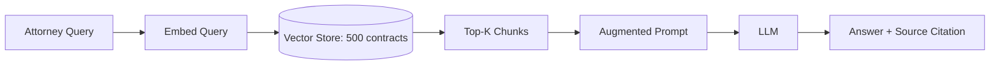

🔗 **System Integration — where this sits in LexClear:**
```mermaid
flowchart LR
    A[Document Sources: DMS, email] --> B[Ingestion & Chunking]
    B --> C[Embedding]
    C --> D[(Vector Store + Neo4j)]
    D --> E[Retrieval Layer]
    E --> F[Generation Layer]
    F --> G[Guardrails + Citations]
    G --> H[Cache]
    H --> I[LiteLLM Gateway]
    I --> J[Attorney Chat UI]

    style E fill:#e63946,stroke:#fff,stroke-width:3px,color:#fff
    style F fill:#e63946,stroke:#fff,stroke-width:3px,color:#fff
```
This week builds the E→F core. Everything else in the diagram — access-controlled ingestion, reranking, guardrails, caching, the gateway — is a later week's upgrade to this same spine, not a separate system.

✅ **Production note:** even at this stage, log retrieval scores per query — it's the cheapest debugging tool you'll ever build, and it's what Week 26 will mine for real traffic patterns.

📁 `01_basic_rag/`

---

### Week 2 — Clause-Aware Chunking vs Naive Fixed-Size
**Pattern:** Pattern 7 — Semantic Indexing · **Level:** Beginner

🎯 **Problem statement:** Contracts use deeply nested clause numbering (e.g., "4.2.1(b)(iii)") and cross-references ("subject to Section 7.3"). Week 1's naive fixed-size chunker splits mid-clause about 1 time in 4 on a spot-check, silently truncating obligations mid-sentence — which is exactly the kind of error a partner will catch immediately and never trust the tool again after.

📚 **Resources:**
- [Pinecone: Chunking Strategies](https://www.pinecone.io/learn/chunking-strategies/)
- [MTEB Leaderboard](https://huggingface.co/spaces/mteb/leaderboard) — compare embedding models empirically instead of by reputation
- [Sentence-Transformers docs](https://www.sbert.net/)

🔨 **Steps:**
1. Build a clause-boundary parser using the contracts' numbering structure (regex against patterns like `\d+\.\d+(\.\d+)?(\([a-z]\))?`) so chunks never split inside a numbered clause
2. Preserve cross-reference context: when a clause says "as defined in Section 2.1," attach a lightweight pointer or the referenced definition inline so the chunk is self-contained
3. Implement two more chunkers for comparison: recursive/structure-aware and semantic (embedding-similarity-based splits)
4. Run the full 500-contract corpus through all three chunkers with 2–3 candidate embedding models from MTEB
5. Build a legal-specific retrieval eval set covering at least 5 clause categories (indemnification, limitation of liability, termination, governing law, confidentiality)
6. Score recall@k for every chunker × embedder combination, and separately measure "clause integrity" (what fraction of retrieved chunks contain a complete, non-truncated clause)
7. Document the winner with the actual numbers — this table is the deliverable, and it's the first real engineering artifact you can show a prospective client

🧩 **Architecture:**
```mermaid
flowchart TD
    A[Raw Contracts] --> B{Chunking Strategy}
    B --> C[Fixed-size + overlap]
    B --> D[Clause-boundary aware]
    B --> E[Semantic similarity split]
    C --> F[Embedding Model]
    D --> F
    E --> F
    F --> G[(Vector Store)]
    G --> H[Recall@k + Clause-Integrity Eval]
```

🔗 **System Integration — where this sits in LexClear:**
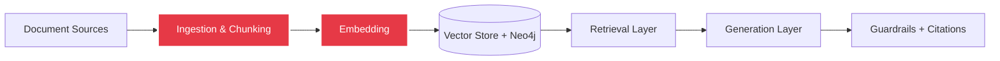
This week upgrades the ingestion stage that every downstream week depends on — a bad chunker here silently caps the ceiling on retrieval quality for the rest of the platform, no matter how good reranking (Week 8) or generation (Week 9) get later.

✅ **Production note:** the "best" chunker is corpus-dependent — this experiment design, not the specific winner, is the reusable artifact you'd bring to a different client's document set.

📁 `02_chunking_and_embeddings/`

---

### Week 3 — Vector Database Deep Dive at 40K-Contract Scale
**Pattern:** Ecosystem Pattern — pgvector / Qdrant internals · **Level:** Beginner

🎯 **Problem statement:** The pilot ran on 500 contracts; full rollout means ~40,000 contracts → roughly 2M chunks after Week 2's chunker, with every query also filtered by matter access permissions, jurisdiction, and privilege status. A vector DB choice that looked fine at 500 documents can fall over — or silently ignore filters — at this scale. You've done exactly this kind of comparison in VectorLens; this week distills it into a clean, standalone, client-facing benchmark.

📚 **Resources:**
- [Qdrant documentation](https://qdrant.tech/documentation/)
- [pgvector](https://github.com/pgvector/pgvector) — Postgres-native, worth knowing cold if a client's IT team wants "just add a column" instead of a new service
- [Pinecone: HNSW explained](https://www.pinecone.io/learn/series/faiss/hnsw/)

🔨 **Steps:**
1. Generate a synthetic 2M-chunk dataset matching LexClear's real shape: realistic metadata cardinality (12 jurisdictions, ~200 distinct matters, privilege flag, document date)
2. Load into both pgvector and Qdrant, matching index configs as closely as the two engines allow
3. Compare index types: HNSW vs IVFFlat — sweep `ef_construction`/`m` (HNSW) and `nlist`/`nprobe` (IVF)
4. Benchmark recall@10, p50/p99 query latency, index build time, and memory footprint on unfiltered queries first
5. Then re-run the *same* queries with realistic metadata filters attached (matter + privilege + jurisdiction) — this is where the two engines diverge most and where most naive benchmarks stop too early
6. Simulate 200 concurrent users (LexClear's actual staff count) hitting the filtered-query path and measure tail latency under load, not just single-query latency
7. Given the self-hosting requirement coming in Phase 6, weight the decision by operational complexity for a small firm IT team, not benchmark numbers alone
8. Write up which engine wins for which workload shape, with the actual numbers

🧩 **Architecture:**
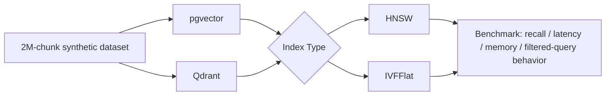

🔗 **System Integration — where this sits in LexClear:**
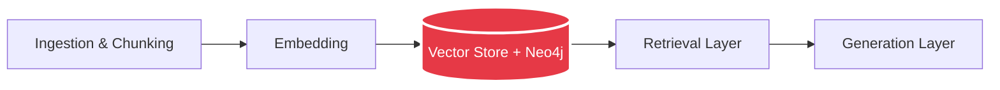
This is the storage layer every other RAG week reads from and writes to — the decision made here is the hardest one to reverse later, since it means a live data migration once the firm has real production data in it.

✅ **Production note:** pull your actual VectorLens benchmark methodology into this folder's `NOTES.md` — this is a week to document and extend, not rediscover from scratch.

📁 `03_vector_db_deep_dive/`

---

### Week 4 — Structured Extraction: Automated Contract Metadata
**Pattern:** Pattern 2 — Grammar · **Level:** Beginner

🎯 **Problem statement:** The compliance team currently has a paralegal manually read every incoming contract (~500/week) to populate a tracking spreadsheet with governing law, termination notice period, auto-renewal flag, and liability cap amount. This is slow, inconsistent between paralegals, and doesn't scale with the firm's growth. It also cannot be allowed to *hallucinate* a liability cap that isn't actually in the contract — a wrong number here is a real business risk, not a UX inconvenience.

📚 **Resources:**
- [Instructor](https://python.useinstructor.com/) — Pydantic-based structured outputs
- [Outlines](https://github.com/dottxt-ai/outlines) — grammar/regex-constrained generation at the token level
- [Anthropic: Tool use](https://docs.claude.com/en/docs/build-with-claude/tool-use) — schema-constrained output via tool-call format

🔨 **Steps:**
1. Define a strict extraction schema with the compliance team's actual four fields, each with an explicit "not present in document" state — never force a value when the clause genuinely doesn't exist
2. Implement it two ways: constrained decoding (Outlines) and schema-guided tool-calling (Instructor or native tool use)
3. Force real edge cases through both: contracts with no liability cap (uncapped liability is a real, common, and important-to-flag state, not a missing field), contracts with liability caps expressed as multiples of fees rather than dollar amounts, contracts in non-English-derived legal phrasing
4. Add a confidence score per extracted field, not just per document
5. Build a "flag for paralegal review" queue for any field below a confidence threshold, instead of silently shipping a possibly-wrong number
6. Validate against 100 contracts the compliance team has already hand-reviewed, treating their existing spreadsheet as ground truth
7. Measure field-level precision/recall separately per field — liability cap extraction and governing law extraction have very different failure modes and shouldn't share one aggregate accuracy number
8. Benchmark latency overhead of constrained decoding vs the retry-based approach at 500 contracts/week volume

🧩 **Architecture:**
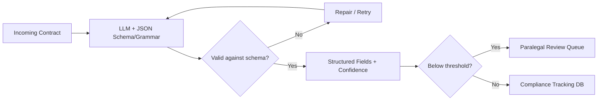

🔗 **System Integration — where this sits in LexClear:**
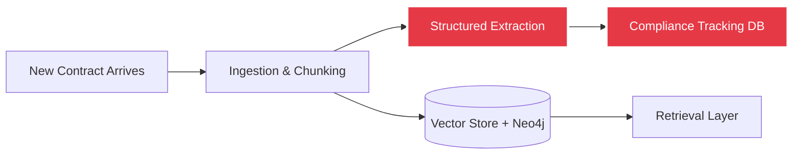
This runs as a side-branch off ingestion, parallel to the RAG indexing path — it's a separate consumer of the same chunked/parsed document, feeding a structured database instead of a vector store.

✅ **Production note:** constrained decoding trades a small latency tax for a *guarantee* — at 500 contracts/week that tax is trivial against the cost of one wrong liability-cap number reaching the tracking spreadsheet unflagged.

📁 `04_structured_extraction/`

---

### Week 5 — Prompt & Semantic Caching Without Cross-Matter Leaks
**Pattern:** Pattern 25 — Prompt Caching · **Level:** Beginner

🎯 **Problem statement:** At a projected 1,500 queries/day, multiple attorneys working the same active deal ask overlapping questions during time-sensitive negotiations ("what's the indemnification cap in this draft," asked by three different associates on the same matter within an hour). Recomputing retrieval and generation for near-identical repeat queries burns cost and adds latency exactly when speed matters most to the client. But naive caching is dangerous here: a cached answer must never be served to an attorney who isn't staffed on that matter — that's not a performance bug, it's a confidentiality breach.

📚 **Resources:**
- [Anthropic: Prompt caching](https://docs.claude.com/en/docs/build-with-claude/prompt-caching) — server-side prefix caching
- [GPTCache](https://github.com/zilliztech/GPTCache) — semantic response caching

🔨 **Steps:**
1. Add prefix caching for the firm-wide system prompt + boilerplate instructions using native API prompt caching
2. Add a separate semantic cache layer: embed incoming queries, check similarity against a cache of past query→answer pairs
3. Key every cache entry by matter ID and access tier, not just query similarity — a semantically identical question from an attorney on a different matter must be a cache *miss* by design
4. Define a cache invalidation policy tied to Week 6's document-versioning: any answer that cites a contract gets invalidated the moment that contract is amended or superseded
5. Simulate a realistic query distribution (exact repeats, near-duplicates within the same matter, near-duplicates across different matters that must NOT hit each other's cache, genuinely novel queries)
6. Measure cost and latency before/after, and separately run an adversarial test specifically trying to get one matter's cached answer to leak to a different matter's query
7. Document the hit-rate vs staleness-risk tradeoff you chose, and the specific access-boundary test that proves the leak case is closed

🧩 **Architecture:**
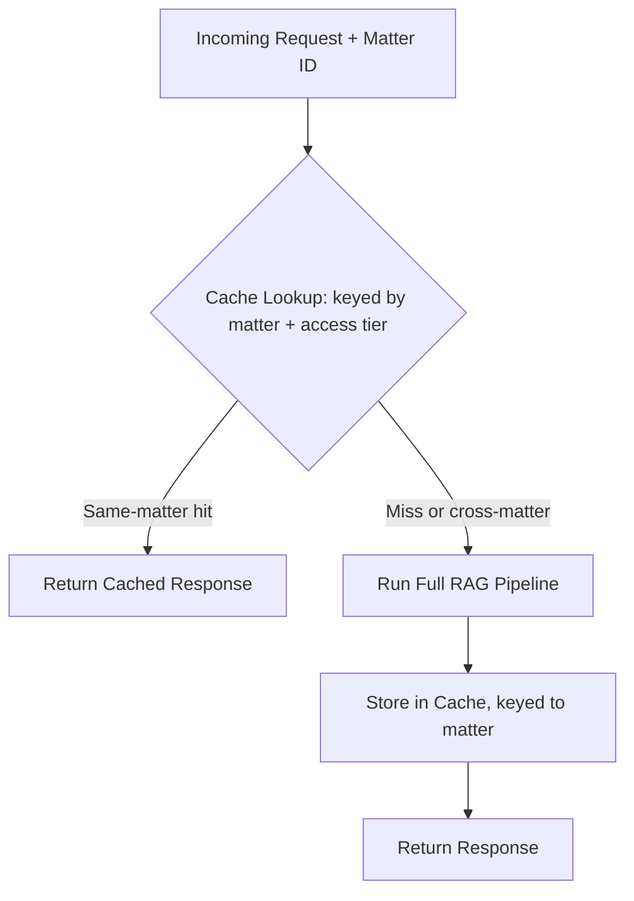

🔗 **System Integration — where this sits in LexClear:**
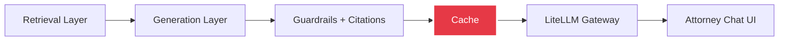
Cache sits after guardrails/citations, not before — you want to cache the *final*, already-validated answer, not risk caching something that skipped a safety check.

✅ **Production note:** semantic caching is a correctness and confidentiality risk here, not just a cost optimization — log every cache hit's similarity score *and* matter-ID match, and treat any cross-matter near-hit as a security incident to investigate, not a tuning parameter.

📁 `05_prompt_caching_for_rag/`

---

## Phase 2 — RAG Intermediate (LexClear) (Weeks 6–10)

### Week 6 — Superseded Documents & Matter-Based Access Control
**Pattern:** Pattern 8 — Indexing at Scale · **Level:** Intermediate

🎯 **Problem statement:** A vendor contract gets amended, and the original executed version stays in the corpus alongside the amendment. In a spot-check against Week 1's naive pipeline, the system retrieves the *outdated original* instead of the current amended terms roughly 30% of the time — which means it's actively capable of giving an attorney confidently wrong advice on a live deal. Separately, and non-negotiably: an attorney must never be able to retrieve a document from a matter they aren't staffed on, regardless of how good their query is.

📚 **Resources:**
- [LlamaIndex: Metadata filtering](https://docs.llamaindex.ai/)
- [Weaviate: Filtered vector search](https://weaviate.io/developers/weaviate)

🔨 **Steps:**
1. Tag every chunk with metadata: source contract, published/executed date, a `supersedes`/`superseded_by` relationship, and matter ID
2. Build the access-control layer first, as a hard pre-filter, not a post-hoc check: query the attorney's staffed-matter list, restrict the retrievable set *before* any vector search runs
3. Implement filtered search: metadata pre-filter → vector search (not vector search → post-filter, which wastes the top-k budget and can leak a restricted document's mere existence through result counts)
4. Add automatic supersession resolution: when both an original and an amendment match a query, exclude the superseded version by default and surface it only if explicitly asked for "the original" or "history"
5. Add reranking on the filtered result set (bridges into Week 8)
6. Build the exact contradiction test case: a contract amended to change a payment term, confirm the system now returns only the current term
7. Build the exact access-control test case: an attorney not staffed on Matter X queries about Matter X's contracts, confirm zero results and a clear "you don't have access to this matter" response rather than a silent empty result that looks like "the answer isn't in the corpus"
8. Load-test the access-filtering path specifically — this is the check that runs on literally every query, so its overhead compounds across 1,500 queries/day

🧩 **Architecture:**
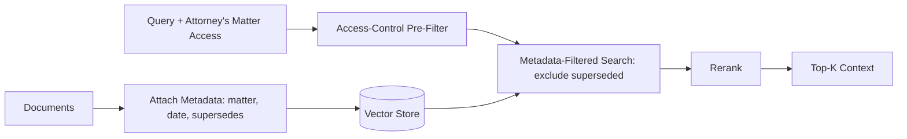

🔗 **System Integration — where this sits in LexClear:**
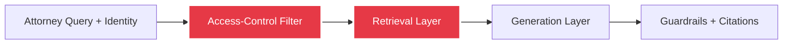
Access control is now a gate that sits *in front of* retrieval for every single query in the platform, including the ones built in Weeks 7–14 — it's worth implementing once here as shared middleware rather than re-solving per pattern.

✅ **Production note:** pre-filtering vs post-filtering is the detail that breaks recall *and* confidentiality silently at scale — verify explicitly which one your vector DB actually does by default, don't assume from the docs.

📁 `06_indexing_at_scale/`

---

### Week 7 — HyDE & Query Expansion: Casual Questions, Formal Documents
**Pattern:** Pattern 9 — Index-aware Retrieval · **Level:** Intermediate

🎯 **Problem statement:** A junior associate asks LexClear "can we get out of this deal early?" The actual contract section is titled "Termination for Convenience" and uses defined terms like "the Non-Breaching Party" — a naive embedding of the casual question sits far from the formal clause language in vector space, and Week 6's otherwise-correct retrieval quietly misses it.

📚 **Resources:**
- [HyDE paper — Precise Zero-Shot Dense Retrieval without Relevance Labels](https://arxiv.org/abs/2212.10496)
- [LlamaIndex: Query transformations](https://docs.llamaindex.ai/)

🔨 **Steps:**
1. Build a library of ~30 real casual-question → formal-clause-language pairs by interviewing (or simulating) how associates actually phrase questions vs how contracts are actually written
2. Implement HyDE: have the LLM draft a hypothetical formal-legalese answer to the casual question, embed *that*, and search with it instead of the raw query embedding
3. Implement query expansion with legal-synonym awareness (early termination / termination for convenience / early exit / walk away) rather than generic paraphrase expansion
4. Add hybrid search (BM25 + dense) as a complementary axis — exact defined-term matches (e.g., "Force Majeure") often want lexical search more than semantic search
5. Run all three (raw query, HyDE, expansion) plus hybrid against your casual/formal pair library and measure recall lift specifically on this mismatch category, not on the general Week 1 eval set
6. Measure the added latency of the extra LLM call HyDE requires, and decide whether to run it on every query or only when initial retrieval confidence is low
7. Test a failure mode explicitly: an overly creative HyDE hypothetical answer that invents plausible-sounding but wrong legal language and search that further from the truth than the raw query would have

🧩 **Architecture:**
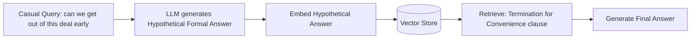

🔗 **System Integration — where this sits in LexClear:**
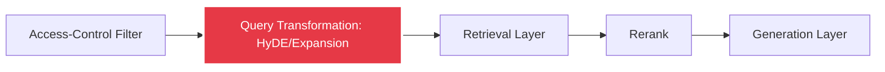
This slots in as a pre-processing step directly ahead of the retrieval call — every downstream week (reranking, generation, corrective RAG) benefits from it without needing to know it's there.

✅ **Production note:** HyDE adds an extra LLM call before retrieval even starts — gate it behind a confidence check (only trigger when raw-query retrieval scores are already low) rather than running it unconditionally on all 1,500 daily queries.

📁 `07_hyde_query_expansion/`

---

### Week 8 — Reranking: Disambiguating 50 Near-Identical Liability Clauses
**Pattern:** Pattern 10 — Node Postprocessing · **Level:** Intermediate

🎯 **Problem statement:** "Limitation of liability" appears in nearly every one of LexClear's 40,000 contracts, so a query about it returns dozens of superficially similar chunks. An attorney asking about liability exposure on a specific counterparty needs the clause from *that* matter, ranked above 49 topically-similar-but-irrelevant clauses from unrelated deals — topical similarity alone (Week 1–7's retrieval) can't make that distinction reliably.

📚 **Resources:**
- [Cohere Rerank docs](https://docs.cohere.com/docs/rerank)
- [Sentence-Transformers: Cross-Encoders](https://www.sbert.net/examples/applications/cross-encoder/README.html)

🔨 **Steps:**
1. Retrieve a wide net (top-50) with the fast bi-encoder + HyDE/hybrid pipeline from Week 7
2. Rerank with a cross-encoder (Cohere Rerank API or a local `ms-marco` cross-encoder model)
3. Add a legal-specific relevance signal on top of the generic reranker: boost chunks whose matter ID or counterparty name matches entities mentioned in the query's conversational context (if the attorney already said which deal they mean)
4. Build a hand-graded eval set specifically of "which of these 10 liability clauses actually answers this specific question about this specific counterparty" — generic relevance eval sets won't catch this failure mode
5. Compare answer quality and citation accuracy: top-5 from bi-encoder alone vs top-5 after rerank vs top-5 after rerank + entity-match boost
6. Measure the added latency of cross-encoder scoring on 50 candidates and decide the top-k → rerank-k tradeoff against LexClear's target response time
7. Test the case where the correct clause is genuinely absent from the top-50 (reranking can't fix a retrieval miss) and confirm the system still refuses rather than confidently reranking the best-of-a-bad-set

🧩 **Architecture:**
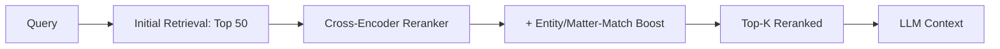

🔗 **System Integration — where this sits in LexClear:**
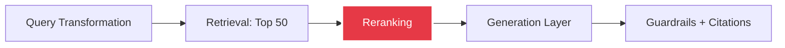
Reranking is the layer between "cast a wide net" and "generate from a precise, small context" — usually the single highest-ROI change to make once the earlier stages are solid.

✅ **Production note:** reranking is usually the highest ROI-per-hour-of-work change you can make to an existing RAG system — a strong before/after benchmark from this folder is worth featuring prominently in your portfolio.

📁 `08_reranking_node_postprocessing/`

---

### Week 9 — Trustworthy Generation: Malpractice-Grade Citations
**Pattern:** Pattern 11 — Trustworthy Generation · **Level:** Intermediate

🎯 **Problem statement:** Attorneys relying on an AI-hallucinated clause citation isn't a hypothetical risk in this industry — there are well-documented incidents of lawyers sanctioned by courts for citing fake, AI-generated case law. For LexClear, a hallucinated clause or a misattributed contract section is a professional liability event, not a UX bug. The system needs to be trustworthy by construction, not by hoping the model behaves.

📚 **Resources:**
- ["Lost in the Middle" paper](https://arxiv.org/abs/2307.03172) — context position affects what the model actually uses
- [RAGAS documentation](https://docs.ragas.io/) — faithfulness/relevance metrics you'll reuse in Week 27

🔨 **Steps:**
1. Implement mandatory inline pincite-style citations: every factual claim in the generated answer must map to a specific source contract name + section number, not a vague "a contract said..."
2. Build a post-generation verification pass: for each cited claim, re-check that the cited section actually contains language supporting it (a lightweight NLI-style entailment check, not just "was this chunk in context")
3. Build an out-of-domain / low-confidence detector: when retrieval scores or entailment checks fall below threshold, refuse and say so explicitly rather than guessing
4. Reorder context using the "lost in the middle" finding — put the most relevant chunk first or last, not buried in the middle of a long context window
5. Add a persistent "AI-generated — verify against the cited source before relying on it" disclaimer in the UI, and make the citation clickable through to the actual source document
6. Adversarially test with questions designed to induce hallucination: ask about a clause type (e.g., "the arbitration clause") in a contract that genuinely has none, and confirm proper refusal instead of a fabricated answer
7. Adversarially test citation accuracy specifically: for 30 generated answers, manually verify every cited section reference actually says what the answer claims it says

🧩 **Architecture:**
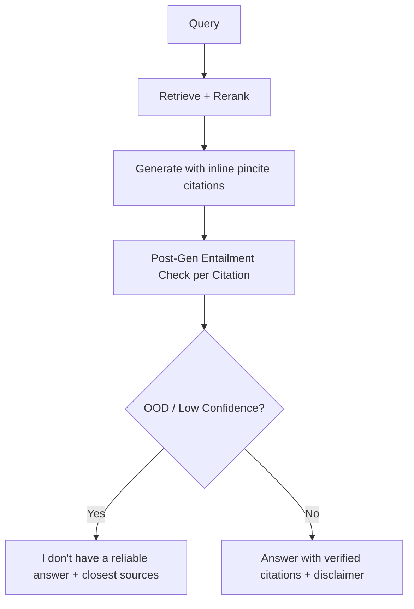

🔗 **System Integration — where this sits in LexClear:**
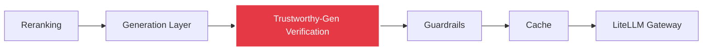
This sits between raw generation and guardrails — it's specifically about *epistemic* trust (is this claim actually supported), distinct from Week 28's guardrails which are about *safety and access* boundaries.

✅ **Production note:** refusing to answer is a UX decision, not just a technical one — a visible "not confident enough to answer" beats a fluent wrong answer, but only if the interface actually surfaces it clearly instead of burying it in fine print.

📁 `09_trustworthy_generation/`

---

### Week 10 — Corrective RAG: Acme Corp vs Acme Corporation Holdings
**Pattern:** Pattern 11 + Pattern 18 — Trustworthy Generation + Reflection · **Level:** Intermediate/Advanced

This is the exact example you originally described — a self-correcting RAG system built for production, not a demo.

🎯 **Problem statement:** LexClear has contracts with both "Acme Corp" and the legally distinct "Acme Corporation Holdings" — different entities, different deals, different obligations. A retrieval based purely on name similarity has, in testing, pulled the wrong entity's contract and generated a confident answer that mixes up two unrelated deals. In legal work, conflating two counterparties isn't a minor inaccuracy — it can misstate who owes what to whom.

📚 **Resources:**
- [Corrective Retrieval Augmented Generation (CRAG) paper](https://arxiv.org/abs/2401.15884)
- [LangGraph](https://langchain-ai.github.io/langgraph/) — the CRAG control-flow (branch/loop/retry) maps naturally onto a graph

🔨 **Steps:**
1. Add a lightweight relevance grader: an LLM call that scores each retrieved chunk as Correct / Ambiguous / Incorrect against the query, with an explicit entity-resolution check (does this chunk's counterparty legally match the one the attorney means, not just share a similar name)
2. **Correct** → use the retrieved docs as-is (fast path, most queries — should stay cheap and low-latency)
3. **Ambiguous** (e.g., name similarity but unclear entity match) → don't guess; refine the query by asking a clarifying follow-up ("did you mean Acme Corp or Acme Corporation Holdings?") or re-retrieve with a tighter entity filter derived from matter metadata
4. **Incorrect** → discard retrieval entirely; either fall back to a firm-wide general-knowledge answer with a clear disclaimer, or return "no matching contract found for that entity"
5. Implement this as an explicit state graph (LangGraph is a natural fit here) so the branching is visible, testable, and auditable — a compliance-relevant property in legal tech, since "why did the system answer this way" needs to be answerable
6. Build the Acme Corp/Acme Corporation Holdings scenario as an explicit, named regression test that must keep passing on every future change
7. Extend the entity-ambiguity test set to other realistic collision cases: parent/subsidiary pairs, contracts with the same counterparty across different years, and near-identical DBA names
8. Track what fraction of real traffic hits each branch over the pilot period, and use that distribution to decide whether the grading call's added latency is worth it fleet-wide or should be selectively triggered

🧩 **Architecture:**
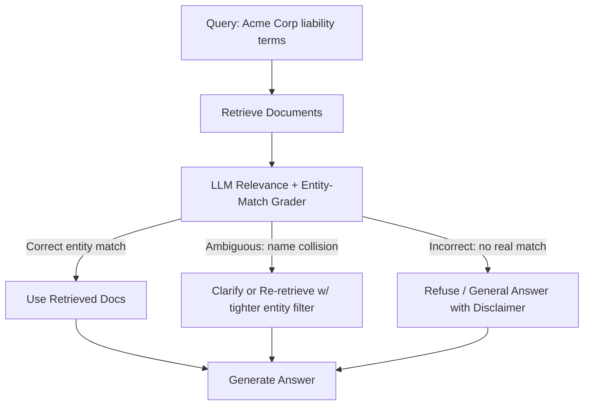

🔗 **System Integration — where this sits in LexClear:**
```mermaid
flowchart LR
    A[Access-Control Filter] --> B[Query Transformation]
    B --> C[Retrieval + Rerank]
    C --> D[Corrective RAG Grading Layer]
    D --> E[Generation + Trustworthy-Gen Verification]
    E --> F[Guardrails]

    style D fill:#e63946,stroke:#fff,stroke-width:3px,color:#fff
```
Corrective RAG sits as a control layer between retrieval and generation — it's the component that decides *whether* the pipeline built in Weeks 1–8 is even trustworthy enough to proceed on for this specific query.

✅ **Production note:** the grading call adds latency to *every* query for a correction that's only needed on some — cache/short-circuit the fast "Correct" path aggressively, and track what fraction of real traffic actually needs each branch so you can tune the grader's threshold with data instead of guessing.

📁 `10_corrective_rag/`

---

## Phase 3 — RAG Advanced / Expert (LexClear) (Weeks 11–14)

### Week 11 — GraphRAG: Change-of-Control Exposure Across the Portfolio
**Pattern:** Pattern 9 (extended) — GraphRAG · **Level:** Advanced

🎯 **Problem statement:** The firm's client is preparing for an acquisition and needs to know: "which of our active vendor contracts have change-of-control clauses that would be triggered by this acquisition, and what happens if they are?" Answering this requires connecting facts across potentially dozens of separate contracts, tracing which entities are related (subsidiaries, parent companies, DBAs), and identifying a specific clause *type* across all of them — a question pure vector similarity can't traverse, because the answer isn't "in" any single chunk.

📚 **Resources:**
- [Microsoft GraphRAG documentation](https://microsoft.github.io/graphrag/)
- [GraphRAG paper — From Local to Global](https://arxiv.org/abs/2404.16130)
- [Neo4j GraphRAG ecosystem](https://neo4j.com/labs/genai-ecosystem/graphrag/) — directly relevant given Documind already runs on Neo4j

🔨 **Steps:**
1. Run entity + relationship extraction over the corpus: parties, corporate family relationships (parent/subsidiary/DBA), contract types, clause categories, effective and expiration dates
2. Load into Neo4j, reusing your Documind schema patterns as a starting point but keeping this graph scoped and standalone for the pilot
3. Add community detection + hierarchical summarization (Microsoft GraphRAG's core contribution) so "global" portfolio-wide questions don't require touching every single document at query time
4. Build the change-of-control question as the flagship end-to-end test: traverse from the acquiring/target corporate entity → all contracts where that entity or a related entity is a party → filter to contracts containing a change-of-control clause type → summarize the triggered obligations
5. Implement both query modes: local search (entity-centric, "what does this specific contract say") and global search (theme-centric, "across everything, what's our aggregate exposure")
6. Compare against a pure-vector baseline (Weeks 1–10's pipeline) on this exact question and document the gap concretely — this contrast is the whole point of the folder
7. Track and report GraphRAG's indexing cost (LLM calls per document during graph construction) against the 500 new documents/week ingestion rate, since this is usually the first question a client asks about a graph-based approach

🧩 **Architecture:**
```mermaid
flowchart TD
    A[40K Contracts] --> B[Entity + Relationship Extraction]
    B --> C[(Knowledge Graph - Neo4j)]
    C --> D[Community Detection + Summarization]
    E["Query: change-of-control exposure"] --> F[Graph Traversal: entity family -> contracts -> clause type]
    D --> F
    F --> G[Generate Portfolio-Wide Answer]
```

🔗 **System Integration — where this sits in LexClear:**
```mermaid
flowchart LR
    A[Ingestion & Chunking] --> B[Vector Store]
    A --> C[Knowledge Graph]
    D[Query] --> E{Question Type}
    E -->|Single-document lookup| B
    E -->|Cross-document / relational| C
    B --> F[Generation Layer]
    C --> F

    style C fill:#e63946,stroke:#fff,stroke-width:3px,color:#fff
    style E fill:#e63946,stroke:#fff,stroke-width:3px,color:#fff
```
GraphRAG runs as a parallel index alongside the vector store, not a replacement for it — the router deciding which path a given question needs is itself a meaningful piece of production logic.

✅ **Production note:** GraphRAG indexing is expensive (many LLM calls per document) — budget for it explicitly against the 500 docs/week ingestion rate and note the cost-per-document in `NOTES.md`; this is usually the first question a client asks.

📁 `11_graphrag/`

---

### Week 12 — Agentic Deep Search: 5-Year Indemnification Trend Analysis
**Pattern:** Pattern 12 — Deep Search · **Level:** Advanced

🎯 **Problem statement:** A partner asks: "how has our standard indemnification clause language evolved across the last 5 years of vendor contracts, and are we more or less protected than we were in 2020?" This requires finding many contracts across a 5-year span, reading and extracting the relevant clause from each, and synthesizing a trend — not a single lookup, and not answerable from any one retrieval pass.

📚 **Resources:**
- [IRCoT — Interleaving Retrieval with Chain-of-Thought](https://arxiv.org/abs/2212.10509)
- Your own Week 16 ReAct loop (OpsPilot) is the same execution substrate applied to a different domain — worth comparing the two once both exist

🔨 **Steps:**
1. Decompose the question into an explicit sub-question plan: "find all vendor contracts 2020–present" → "extract the indemnification clause from each" → "group by year" → "compare and identify the trend"
2. Loop: search → read → reason → decide if there's enough evidence yet → repeat or synthesize, using Week 11's graph to efficiently enumerate the candidate contract set first rather than searching blind
3. Track evidence explicitly across iterations in a running structured list (contract name, year, extracted clause text, brief characterization) — don't rely on it staying implicitly correct in a long context window
4. Cap iterations with a hard budget (this can get expensive fast across dozens of contracts) and build a graceful "here's what I found across N of the M contracts, here's what's still uncertain" fallback
5. Produce a synthesized answer with a supporting table (contract, year, clause summary) an attorney can actually verify line by line, not just a prose paragraph asserting a trend
6. Compare against a single-pass RAG attempt at the same question (Week 1's baseline) and document how it fails — usually by answering from 3–5 lucky retrievals instead of genuinely covering the 5-year span
7. Test cost and latency at the realistic scale (a 5-year vendor-contract query might touch 40–80 documents) and set expectations accordingly — this is not a sub-second query pattern and shouldn't be advertised as one

🧩 **Architecture:**
```mermaid
flowchart TD
    A["5-year trend question"] --> B[Plan Sub-Questions]
    B --> C[Search: enumerate candidate contracts via graph]
    C --> D[Read + Extract Clause per Contract]
    D --> E{Enough Evidence / Iteration Budget?}
    E -->|No| C
    E -->|Yes| F[Synthesize Trend + Supporting Table]
```

🔗 **System Integration — where this sits in LexClear:**
```mermaid
flowchart LR
    A[Query Router] --> B{Single-doc or Multi-hop?}
    B -->|Single-doc| C[Standard RAG: Weeks 1-10]
    B -->|Multi-hop research| D[Deep Search Loop]
    D --> E[Knowledge Graph]
    D --> F[Vector Store]
    D --> G[Synthesized Answer]

    style D fill:#e63946,stroke:#fff,stroke-width:3px,color:#fff
```
Deep search is a distinct query mode the router selects into, not something every query runs through — most of LexClear's 1,500 daily queries are single-lookup and should stay on the cheap, fast Week 1–10 path.

✅ **Production note:** unbounded iteration loops are a cost and latency landmine — put a hard iteration cap and a token budget in from day one, and be explicit with the client that this query mode trades speed for depth.

📁 `12_agentic_deep_search/`

---

### Week 13 — Self-RAG: Skipping Retrieval on Firm-Wide Policy Questions
**Pattern:** Pattern 31 — Self-Check · **Level:** Expert

🎯 **Problem statement:** Roughly 40% of real query volume, once the pilot data comes in, turns out to be generic firm-policy questions ("what's our standard notice period for termination clauses") that have one well-established answer, not matter-specific questions requiring fresh retrieval across the corpus. Retrieving on every query wastes cost and adds latency for a fraction of traffic that doesn't need it.

📚 **Resources:**
- [Self-RAG paper — Learning to Retrieve, Generate, and Critique](https://arxiv.org/abs/2310.11511)

🔨 **Steps:**
1. Add a "retrieval needed?" gate before searching at all — classify whether the query is firm-wide/general (answerable from a small, cached policy summary) or matter-specific (needs fresh retrieval)
2. When retrieval happens, generate with explicit self-critique: is this chunk actually relevant? Is the generated claim actually supported by it, not just topically adjacent?
3. If the critique fails, retrieve again with a refined query (bounded retries, feeding into Week 10's corrective logic rather than duplicating it)
4. Build the firm-wide policy summary as a small, explicitly maintained knowledge base (distinct from the full 40K-contract corpus) that the "skip retrieval" path draws from, and define who's responsible for keeping it current
5. Compare token/cost usage against always-retrieve RAG on the real pilot query mix (using actual logged query patterns from Week 1's pilot, not synthetic ones)
6. Spot-check a sample of "skipped retrieval" answers by hand to confirm the gate isn't overconfident — a wrongly-skipped matter-specific question is worse than the cost savings are worth
7. Set up ongoing monitoring: track the skip-rate over time, since a system that starts skipping retrieval on genuinely matter-specific questions as it "learns" bad shortcuts needs to be caught early

🧩 **Architecture:**
```mermaid
flowchart TD
    A[Query] --> B{Firm-wide policy or matter-specific?}
    B -->|Firm-wide| C[Generate from maintained policy summary]
    B -->|Matter-specific| D[Retrieve]
    D --> E[Generate w/ Self-Critique]
    E --> F{Relevant + Supported?}
    F -->|No| D
    F -->|Yes| G[Final Answer]
```

🔗 **System Integration — where this sits in LexClear:**
```mermaid
flowchart LR
    A[Access-Control Filter] --> B[Retrieval-Need Gate]
    B -->|Skip| C[Policy Summary Store]
    B -->|Retrieve| D[Full RAG Pipeline: Weeks 6-10]
    C --> E[Generation]
    D --> E

    style B fill:#e63946,stroke:#fff,stroke-width:3px,color:#fff
    style C fill:#e63946,stroke:#fff,stroke-width:3px,color:#fff
```
This adds a fast lane in front of the full pipeline — it doesn't replace anything built in Weeks 1–10, it decides which queries even need to reach them.

✅ **Production note:** this pattern trades a more complex pipeline for real cost savings on easy queries — only worth the complexity because you now have real logged data (from the Week 1 pilot) showing a genuine easy/hard mix, not a guess.

📁 `13_self_rag/`

---

### Week 14 — Capstone: LexClear v1 for the Compliance Group
**Pattern:** Assembled from Weeks 1–13 · **Level:** Expert

🎯 **Problem statement:** Individually correct components — access control, caching, reranking, trustworthy generation, corrective RAG, GraphRAG, deep search, Self-RAG — still need to be wired into one coherent, observable, auditable service before the 25-person compliance group can actually use it day to day. That integration, plus a real go/no-go decision process, is its own skill and the actual deliverable of this phase.

📚 **Resources:**
- [FastAPI documentation](https://fastapi.tiangolo.com/)
- Reuse RAGAS from Week 9 for a regression eval suite

🔨 **Steps:**
1. Wrap Weeks 5, 6, 8, 9, 10, and 13 (caching, access control, reranking, trustworthy generation, corrective RAG, Self-RAG's routing gate) behind one FastAPI service, with Week 11/12 available as an explicit "deep research" mode rather than the default path
2. Add request logging: query, attorney identity, matter access context, retrieved chunk IDs, relevance/entailment scores, cache hit/miss, corrective-RAG branch taken, latency breakdown per stage
3. Add a `/health` and `/eval` endpoint — the eval endpoint runs your RAGAS suite plus the Acme Corp entity-collision regression test on demand and returns faithfulness/relevance/entity-accuracy scores
4. Containerize with Docker Compose (vector DB + graph DB + API + cache in one stack, same shape as your Documind setup)
5. Build a real rollout plan for the 25-person group: which matters/document sets are in scope for v1, what's explicitly out of scope, and a rollback path if the pilot surfaces a serious accuracy issue
6. Define the go/no-go metrics in writing before rollout (e.g., zero hallucinated citations across a 200-query audit sample, 95%+ retrieval@5, p95 latency under a defined bound) and actually run that audit before flipping it on for the full group
7. Load-test it lightly here as a preview of Week 26's deeper treatment, using the compliance group's realistic concurrent-user count (25, not 200 — that's the firm-wide number for later)

🧩 **Architecture:**
```mermaid
flowchart LR
    A[Compliance Attorney] --> B[API Gateway]
    B --> C[Access Control]
    C --> D{Query Mode}
    D -->|Standard| E[Cache -> Retrieve+Rerank -> Corrective RAG]
    D -->|Deep Research| F[GraphRAG + Deep Search]
    E --> G[Trustworthy-Gen Verification]
    F --> G
    G --> H[Guardrails]
    H --> I[Log to Observability]
    I --> J[Response + Citations]
```

🔗 **System Integration — where this sits in LexClear:**
```mermaid
flowchart LR
    A[Weeks 1-13: individual components] --> B[Capstone: LexClear v1 Service]
    B --> C[Compliance Group Pilot: 25 users]
    C --> D{Go/No-Go Audit}
    D -->|Pass| E[Candidate for firm-wide rollout: 200 users]
    D -->|Fail| F[Rollback + Root-Cause Fix]

    style B fill:#e63946,stroke:#fff,stroke-width:3px,color:#fff
```
This is the folder where every earlier week stops being an isolated pattern demo and becomes one deployable service — the diagram above is the actual decision process a real engagement goes through, not just a technical assembly step.

✅ **Production note:** this is the folder to link directly in Upwork proposals — it demonstrates the full pipeline end-to-end with a real go/no-go process, not just one pattern in isolation.

📁 `14_capstone_rag_api/`

---

## Phase 4 — Agents (OpsPilot) (Weeks 15–20)

### Week 15 — Tool Calling: Replacing Four Dashboards Under Pressure
**Pattern:** Pattern 21 — Tool Calling · **Level:** Intermediate

🎯 **Problem statement:** OpsPilot's on-call engineer currently has to manually check a metrics dashboard, a log search tool, a deploy history page, and a runbook wiki during every incident — burning several of the most valuable minutes of a 55-minute average MTTR just navigating between systems. The engineering org wants an agent that can query all of this directly, but a tool that returns wrong data silently during a live incident is worse than no tool at all.

📚 **Resources:**
- [Anthropic: Tool use](https://docs.claude.com/en/docs/build-with-claude/tool-use)
- [OpenAI: Function calling](https://platform.openai.com/docs/guides/function-calling)

🔨 **Steps:**
1. Define tools with strict JSON schemas for: querying error rate/latency/saturation metrics by service and time window, querying recent structured logs with service/severity/time filters, looking up the runbook for a given service, and querying recent deploy history
2. Implement the full loop: model emits a tool call → your code executes it against a (synthetic, for this repo) metrics/log dataset → result goes back to the model → model incorporates it
3. Validate every tool argument server-side before execution — a malformed time-window or an out-of-range service name must fail loudly, not silently return an empty or wrong result during a live incident
4. Add parallel tool calling so the agent can request metrics, logs, and deploy history in one turn instead of three sequential round-trips — every second matters against the MTTR target
5. Handle tool timeouts and errors explicitly: the underlying monitoring system being slow or down is itself common during a real incident, and the agent needs a defined fallback, not a hang
6. Test a query requiring tool chaining: "why is checkout-service erroring" → query error rate spike → identify the time it started → query deploy history around that window → correlate
7. Benchmark the full round-trip latency of the tool-calling loop itself against the manual four-dashboard baseline, since "faster than a human doing it manually" is the actual product claim being tested here

🧩 **Architecture:**
```mermaid
sequenceDiagram
    participant E as On-call Engineer
    participant L as Agent (LLM)
    participant T as Tools: metrics/logs/runbooks/deploys
    E->>L: "Why is checkout-service erroring?"
    L->>L: Decide which tools are needed
    L->>T: Query error rate + deploy history (parallel)
    T->>L: Return results
    L->>E: Summary with next diagnostic step
```

🔗 **System Integration — where this sits in OpsPilot:**
```mermaid
flowchart LR
    A[Alert Trigger] --> B[Triage Agent]
    B --> C[Tool Layer]
    C --> D[Metrics API]
    C --> E[Logs API]
    C --> F[Runbook Wiki]
    C --> G[Deploy History]
    B --> H[RCA / Remediation / Postmortem Agents]

    style C fill:#e63946,stroke:#fff,stroke-width:3px,color:#fff
```
The tool layer built this week is the shared substrate every later OpsPilot agent (triage, RCA, remediation, postmortem) calls into — get the argument validation and error handling right once, here.

✅ **Production note:** validate tool arguments server-side before execution regardless of schema constraints on generation — never trust the model's output as the only safety layer, especially mid-incident when a wrong query could send the on-call engineer chasing the wrong signal.

📁 `15_tool_calling_fundamentals/`

---

### Week 16 — CoT/ReAct Triage Agent: The Checkout-Service Error Spike
**Pattern:** Pattern 13 — Chain of Thought · **Level:** Intermediate

🎯 **Problem statement:** An alert fires: "checkout-service error rate above threshold." There are several plausible causes — a recent deploy, a downstream dependency failure, resource exhaustion, a bad config push — and jumping to the first plausible one wastes time if it's wrong. The agent needs to investigate systematically and show its reasoning, because a human will be reading that reasoning under time pressure and needs to trust or override it quickly.

📚 **Resources:**
- [Chain-of-Thought Prompting paper](https://arxiv.org/abs/2201.11903)
- [ReAct — Synergizing Reasoning and Acting paper](https://arxiv.org/abs/2210.03629)

🔨 **Steps:**
1. Build a baseline CoT prompt for triage reasoning and confirm it beats a direct "just tell me the cause" prompt on a set of synthetic incident scenarios with known root causes
2. Extend to full ReAct: explicit Thought → Action → Observation loop, using Week 15's tools — check recent deploys first (cheapest, most common cause), then dependency health, then resource metrics, narrowing systematically rather than jumping around
3. Log the full reasoning trace (every thought/action/observation) in a human-readable format — this is what the on-call engineer reads to decide whether to trust the agent's conclusion, and it's what Week 18's postmortem agent consumes later
4. Add a hard time-box: incidents are urgent, the agent can't reason indefinitely, and a triage that takes 8 minutes to conclude has already eaten most of the MTTR budget
5. Add a "stuck" detector: if the agent repeats the same tool call without new information, force it to either conclude with its best hypothesis and a confidence level, or escalate to a human
6. Build 5 synthetic incident scenarios with known, different root causes (bad deploy, downstream timeout, memory leak, DB connection exhaustion, bad config) and measure whether triage correctly narrows to the right one, not just *a* plausible one
7. Compare trace quality and time-to-conclusion against the Week 15 tool-calling loop without explicit reasoning steps, to justify the added complexity with a number

🧩 **Architecture:**
```mermaid
flowchart TD
    A["Alert: checkout-service error spike"] --> B[Thought: check likely causes in order]
    B --> C["Action: query recent deploys"]
    C --> D[Observation]
    D --> E{Root cause found or time-boxed out?}
    E -->|No, more investigation needed| B
    E -->|Yes| F[Conclusion + Confidence + Full Trace]
```

🔗 **System Integration — where this sits in OpsPilot:**
```mermaid
flowchart LR
    A[Alert Ingestion] --> B[Triage Agent: ReAct loop]
    B --> C[Tool Layer]
    B --> D[Trace Log]
    B --> E[RCA confirmed?]
    E -->|Yes| F[Remediation Planning]
    E -->|No| G[Escalate to Human]
    D --> H[Postmortem Agent later]

    style B fill:#e63946,stroke:#fff,stroke-width:3px,color:#fff
```
Triage is the entry point for every incident going forward — its trace becomes the shared input both the remediation planner (Week 17) and the postmortem writer (Week 18) build on.

✅ **Production note:** full trace logging here is what makes Week 26's degradation testing and Week 27's LLM-as-judge eval possible later — build the logging discipline now, not retroactively once the org depends on the tool.

📁 `16_cot_react_agent/`

---

### Week 17 — Tree of Thoughts: Ranking Remediation Strategies by Risk
**Pattern:** Pattern 14 — Tree of Thoughts · **Level:** Advanced

🎯 **Problem statement:** Once triage identifies "database connection pool exhausted" as the root cause, there isn't one obvious fix — scale up the connection pool, restart the affected service, roll back the last deploy, or enable a circuit breaker are all plausible, with different speed, risk, and reversibility profiles. Picking the wrong one under pressure can make an incident worse, not better, so this needs actual comparison, not the first idea that comes to mind.

📚 **Resources:**
- [Tree of Thoughts paper](https://arxiv.org/abs/2305.10601)

🔨 **Steps:**
1. Generate multiple candidate remediation branches from the confirmed root cause (aim for 3–4 genuinely different strategies, not minor variations of one idea)
2. Score each branch explicitly on: estimated time-to-effect, reversibility (can this be undone cleanly if it doesn't help), blast radius (does this affect only the broken service or other dependents too), and confidence that it addresses the actual root cause
3. Bias the ranking toward reversible actions when confidence in the root cause is anything less than very high — an irreversible action taken on a wrong diagnosis is the worst outcome in this whole system
4. Once Week 20's incident memory exists, incorporate "what worked for similar past incidents" as an additional scoring input, and note in this week's `NOTES.md` where you'd wire that in
5. Output a ranked recommendation with explicit reasoning per option — this stays a *recommendation* at this stage, not an auto-executed action (that gating is Week 20/28's job)
6. Test the genuinely ambiguous case: two remediation options score close enough that the "right" choice depends on business context the agent doesn't have (e.g., is this the middle of a critical customer's onboarding call) — confirm the agent flags the ambiguity to the human rather than silently picking one
7. Measure the added token cost of generating and scoring multiple branches against a single-suggestion baseline, and justify it against the cost of a wrong remediation choice

🧩 **Architecture:**
```mermaid
flowchart TD
    A["Root cause: DB connection pool exhausted"] --> B[Branch: scale connection pool]
    A --> C[Branch: restart service]
    A --> D[Branch: rollback last deploy]
    A --> E[Branch: enable circuit breaker]
    B --> F[Score: speed / reversibility / blast radius]
    C --> F
    D --> F
    E --> F
    F --> G[Ranked Recommendation + Reasoning]
```

🔗 **System Integration — where this sits in OpsPilot:**
```mermaid
flowchart LR
    A[Triage Agent: confirmed root cause] --> B[Remediation Planner: ToT]
    B --> C[Incident Memory: similar-past-incident scoring input]
    B --> D[Ranked Options + Reasoning]
    D --> E{High-risk action selected?}
    E -->|Yes| F[Human Approval Gate]
    E -->|No| G[Execute]

    style B fill:#e63946,stroke:#fff,stroke-width:3px,color:#fff
```
The planner sits between triage's diagnosis and the actual execution step — Week 28's guardrails formalize the approval gate this diagram already shows as necessary.

✅ **Production note:** ToT's token cost scales fast with branching factor and depth — this pattern earns its keep specifically because a wrong remediation choice here has real production consequences; don't reach for it on a decision that's cheap to get wrong.

📁 `17_tree_of_thoughts/`

---

### Week 18 — Reflection: Postmortems That Survive Time Pressure
**Pattern:** Pattern 18 — Reflection · **Level:** Advanced

🎯 **Problem statement:** Postmortems written immediately after an incident, while the on-call engineer is exhausted and wants to close the loop and go back to sleep, are reliably incomplete — vague root causes, missing timeline precision, no concrete action items. A draft-then-critique loop can measurably raise the floor on postmortem quality without adding to the human's workload during the worst part of the process.

📚 **Resources:**
- [Reflexion paper](https://arxiv.org/abs/2303.11366)
- [Self-Refine paper](https://arxiv.org/abs/2303.17651)

🔨 **Steps:**
1. Generate a first-draft postmortem automatically from the full incident trace (Week 16's triage trace + Week 17's remediation trace + timestamps) plus any human notes added during the incident
2. Build an explicit critique pass against a concrete rubric: timeline completeness (every state change timestamped), clear and specific root cause (not "the service had issues"), actionable follow-up items with owners, and blameless tone (describes systems and decisions, not people)
3. Feed the critique back and regenerate, capped at 2–3 rounds
4. Track whether each round actually improves the draft against the rubric — measure it explicitly, since reflection can plateau or even make a draft worse past a certain point by over-editing
5. Build a small rubric-graded set of past-style postmortems (some genuinely good, some genuinely weak, written or adapted for this exercise) and confirm the critique pass reliably distinguishes them
6. Compare final quality and total cost against a single-shot generation using a longer, more detailed initial prompt instead of the multi-round loop, to justify the extra complexity
7. Add a final human-review step in the UI — this pattern should produce a strong draft for an engineer to approve and adjust, not a document that ships unread

🧩 **Architecture:**
```mermaid
flowchart LR
    A[Incident Trace + Human Notes] --> B[Draft Postmortem]
    B --> C[Critic: rubric check]
    C --> D{Meets rubric?}
    D -->|No| E[Revise]
    E --> C
    D -->|Yes| F[Final Draft for Human Approval]
```

🔗 **System Integration — where this sits in OpsPilot:**
```mermaid
flowchart LR
    A[Triage Trace] --> B[Remediation Trace]
    B --> C[Postmortem Agent: Reflection loop]
    C --> D[Human-Approved Postmortem]
    D --> E[(Incident Memory Store)]
    E -.feeds future triage/remediation.-> A

    style C fill:#e63946,stroke:#fff,stroke-width:3px,color:#fff
```
The postmortem agent is the last stage of one incident's lifecycle and, via the memory store, the first input to the *next* similar incident's triage — this is the loop that makes OpsPilot actually improve over time instead of restarting from zero every incident.

✅ **Production note:** reflection roughly multiplies your cost by the number of rounds — measure the marginal quality gain per round on the rubric-graded set and cut the loop where it stops paying for itself.

📁 `18_reflection_agent/`

---

### Week 19 — Code-Execution Agent: Correlating the Spike Against Deploys
**Pattern:** Pattern 22 — Code Execution · **Level:** Advanced

🎯 **Problem statement:** Real root-cause analysis often needs actual computation, not just reasoning — "correlate the exact timing of the error spike against the last 10 deploys across all affected services" isn't answerable by an LLM thinking about it in prose, it needs to actually load and crunch the timeseries data.

📚 **Resources:**
- [E2B — sandboxed code execution](https://e2b.dev/docs)
- [Anthropic: Code execution tool](https://docs.claude.com/en/docs/agents-and-tools/tool-use/code-execution-tool)

🔨 **Steps:**
1. Set up a sandboxed execution environment (E2B or a locked-down local Docker container) with **read-only** access to a synthetic copy of metrics/log/deploy data — never grant a code-execution agent write access to anything production, this is a hard boundary, not a configuration choice
2. Give the agent a correlation task (align error-rate timeseries against deploy timestamps, flag any deploy within N minutes of the spike onset) and let it write and execute analysis code
3. Handle the error-repair loop: execution fails (bad import, wrong data shape) → error goes back to the model → model fixes and retries, capped at a few attempts
4. Enforce hard sandbox constraints as infrastructure, not model instructions: execution timeout, memory cap, no network access unless a specific task genuinely requires it
5. Test with a task that requires at least one real iteration (seed a subtly malformed dataset so the first code attempt hits a real bug) to confirm the repair loop actually works, not just the happy path
6. Feed the correlation output back into Week 16's triage trace as additional evidence, and confirm the triage agent can use a quantitative finding ("deploy at 14:32 correlates with spike at 14:34, r=0.91") alongside its qualitative reasoning
7. Document exactly what data the sandbox can and cannot reach — this is the section of `NOTES.md` a security-conscious client will actually read first

🧩 **Architecture:**
```mermaid
flowchart TD
    A["Task: correlate spike against last 10 deploys"] --> B[Agent Writes Analysis Code]
    B --> C[Sandbox: read-only synthetic data, no network]
    C --> D{Execution Success?}
    D -->|Error| E[Agent Reads Error, Revises]
    E --> B
    D -->|Success| F[Correlation Result: deploy X at 14:32, r=0.91]
```

🔗 **System Integration — where this sits in OpsPilot:**
```mermaid
flowchart LR
    A[Triage Agent] --> B[Code-Execution Agent]
    B --> C[Sandbox: read-only data copy]
    C --> D[Quantitative Finding]
    D --> A

    style B fill:#e63946,stroke:#fff,stroke-width:3px,color:#fff
    style C fill:#e63946,stroke:#fff,stroke-width:3px,color:#fff
```
This agent is called *by* triage as a specialized tool for quantitative analysis, feeding its result back into the same reasoning trace — it's a capability triage reaches for, not a separate pipeline.

✅ **Production note:** sandbox isolation is a security requirement, not a nice-to-have — treat every code-execution agent as if the generated code were untrusted, because functionally it is, and the read-only boundary is what makes this safe to run unattended during a live incident.

📁 `19_code_execution_agent/`

---

### Week 20 — Multi-Agent Incident Team + "We Saw This 3 Months Ago"
**Pattern:** Pattern 23 + Pattern 28 — Multi-agent Collaboration + Long-Term Memory · **Level:** Advanced

🎯 **Problem statement:** Full incident response is really four specialized jobs — triage, root-cause analysis, remediation planning, postmortem writing — currently done by one exhausted human doing all four sequentially. Worse, valuable institutional knowledge ("we saw this exact connection-pool-exhaustion pattern 3 months ago, here's what worked") lives only in whichever engineer happens to remember it, and doesn't reliably surface to whoever's on call this time.

📚 **Resources:**
- [LangGraph — multi-agent docs](https://langchain-ai.github.io/langgraph/) — largest 2026 production footprint for graph-based multi-agent orchestration; start here for anything you intend to actually ship
- [CrewAI docs](https://docs.crewai.com/) — faster to prototype role-based crews if you want to compare approaches
- [Mem0](https://docs.mem0.ai/) — quick to set up for session-persistent memory
- [Letta (formerly MemGPT)](https://docs.letta.com/) — closer fit for long-running autonomous agents with self-editing memory

🔨 **Steps:**
1. Orchestrate the four specialists built across Weeks 15–19 (Triage, RCA/Code-Execution, Remediation Planner, Postmortem Writer) as a LangGraph state machine with an explicit handoff contract between each stage
2. Implement incident memory (Mem0 or Letta) indexed by symptom pattern (service, error signature, resource metric pattern), not just free-text similarity — symptom-pattern matching is what actually lets "we saw this before" surface reliably
3. Wire memory retrieval into the *triage* stage specifically: when a new incident's symptoms match a past one closely, surface the past incident's confirmed root cause and what remediation worked as a first hypothesis, not a final answer
4. Define the orchestrator's handoff contract precisely: what each stage must produce for the next stage to proceed, and what happens when a stage can't reach a confident conclusion (RCA agent should escalate cleanly to a human, not pass a low-confidence guess downstream silently)
5. Build 3 synthetic "recurring incident" scenarios (same underlying pattern, different surface symptoms) specifically to test whether memory retrieval generalizes past-incident learning or just does exact-match recall
6. Measure whether memory-augmented triage narrows to the correct root cause faster than the Week 16 version without memory, on the recurring-incident test set specifically
7. Test the full failure path end-to-end: RCA agent can't reach confidence → escalates → human resolves manually → the resolution still gets written to memory so the *next* occurrence benefits, even though this one wasn't automated

🧩 **Architecture:**
```mermaid
flowchart TD
    A[Alert] --> B[Orchestrator]
    B --> C[Triage Agent]
    C --> D[Memory Retrieval: similar past incidents]
    D --> C
    C --> E[RCA / Code-Execution Agent]
    E --> F[Remediation Planner]
    F --> G[Postmortem Writer]
    G --> H[(Incident Memory Store)]
    H -.indexed by symptom pattern.-> D
```

🔗 **System Integration — where this sits in OpsPilot:**
```mermaid
flowchart LR
    A[Alert Ingestion] --> B[Multi-Agent Orchestrator]
    B --> C[Specialist Agents: Weeks 15-19]
    C --> D[(Incident Memory)]
    B --> E[Guardrails / Approval Gate]
    E --> F[MCP Tool Layer: Weeks 21-22]

    style B fill:#e63946,stroke:#fff,stroke-width:3px,color:#fff
    style D fill:#e63946,stroke:#fff,stroke-width:3px,color:#fff
```
This is the assembly point for everything built in Phase 4 — the orchestrator and memory store are what turn five separate weekly demos into one coherent incident-response system, and they're what Phase 5's MCP layer exposes externally next.

✅ **Production note:** multi-agent systems fail in more, harder-to-debug ways than single agents — the eval pipeline and failure-recovery logic matter more than which framework you pick; don't skip Week 27's LLM-as-judge work when this ships.

📁 `20_multi_agent_and_memory/`

---

## Phase 5 — MCP (Model Context Protocol) (OpsPilot) (Weeks 21–22)

### Week 21 — MCP Server: One Tool Layer, Every Client
**Pattern:** Ecosystem Pattern — Model Context Protocol · **Level:** Advanced

🎯 **Problem statement:** Week 15's tools currently only work inside OpsPilot's own agent codebase. But the SRE team also wants to query the same runbook and metrics tools from their existing Slack incident channel, and individual engineers want the same lookups available from their IDE while debugging manually outside of a formal incident. Rewriting the tool layer per client is exactly the duplicated-effort problem MCP exists to solve.

📚 **Resources:**
- [Model Context Protocol documentation](https://modelcontextprotocol.io/)
- [Build an MCP server — official guide](https://modelcontextprotocol.io/docs/develop/build-server)
- [MCP Python SDK](https://github.com/modelcontextprotocol/python-sdk)

🔨 **Steps:**
1. Wrap Week 15's metrics/logs/runbook/deploy-history tools as an MCP server, exposing them as **tools** the way they already work, plus runbooks specifically as **resources** (browsable, not just query-response)
2. Add an MCP **prompt** for the most common triage starting query ("investigate current alerts for service X") so any client gets a consistent, pre-built entry point instead of every integration re-inventing the initial prompt
3. Run the server locally over stdio first, then over HTTP+SSE for remote clients (the Slack integration and IDE won't be running on the same machine as the server)
4. Add auth/scoping: an engineer using this from their IDE for casual debugging shouldn't have the same access as the formal incident-response orchestrator — scope tool access to the calling context
5. Connect it from at least one real MCP-compatible client (Claude Desktop or another MCP host) to confirm it actually works outside your own test harness, not just against code you wrote to test it
6. Document the server's tool/resource contract the way you'd document a public API, since — once other engineers connect to it — that's exactly what it now is
7. Test what happens when two different clients (the Slack bot and an IDE session) query the server concurrently, since this server is now shared infrastructure, not a single agent's private tool

🧩 **Architecture:**
```mermaid
flowchart LR
    A[OpsPilot Tools: metrics/logs/runbooks/deploys] --> B[MCP Server]
    B --> C[Tools]
    B --> D[Resources: runbooks]
    B --> E[Prompts: triage starter]
    B --> F[MCP Protocol: stdio / HTTP+SSE]
    F --> G[Slack Incident Bot]
    F --> H[Engineer's IDE]
    F --> I[OpsPilot Orchestrator itself]
```

🔗 **System Integration — where this sits in OpsPilot:**
```mermaid
flowchart LR
    A[Multi-Agent Orchestrator] --> B[MCP Server]
    C[Slack Bot] --> B
    D[Engineer IDE] --> B
    B --> E[Metrics/Logs/Runbooks/Deploys]

    style B fill:#e63946,stroke:#fff,stroke-width:3px,color:#fff
```
The orchestrator becomes just one of several clients of this server — a meaningful shift from "the agent has tools" to "the tools exist independently and the agent is one consumer."

✅ **Production note:** MCP is now supported across essentially every major agent framework as the standard tool-interop layer — a server built this week is directly reusable in Week 30's capstone, not throwaway practice.

📁 `21_mcp_server/`

---

### Week 22 — Multi-Server MCP Client: Spanning Your Tools, Logs, and the Wiki
**Pattern:** Ecosystem Pattern — Model Context Protocol · **Level:** Advanced

🎯 **Problem statement:** Full incident response needs more than OpsPilot's own tools — it needs the team's actual metrics platform, actual centralized logging system, and actual runbook wiki, realistically three separate systems (some possibly pre-built third-party MCP servers, not ones you'd write yourself). The agent needs to compose capabilities across all of them in one investigation.

📚 **Resources:**
- [MCP documentation — client concepts](https://modelcontextprotocol.io/docs)
- [MCP servers reference repo](https://github.com/modelcontextprotocol/servers) — pre-built servers to connect alongside your own

🔨 **Steps:**
1. Build (or adopt a framework's) MCP client capable of connecting to multiple servers simultaneously: your Week 21 server, a filesystem server for runbook docs stored outside the wiki, and one reference server from the public registry
2. Let the agent's model decide which server's tools to call at each step based on the investigation's current need — no hardcoded routing logic deciding "always check server A first"
3. Handle one server being unreachable mid-incident gracefully: the agent should degrade (proceed with the tools it can still reach, note the gap explicitly) rather than crash — the agent going down during a live incident is its own incident
4. Add a timeout policy per server so one slow/hanging server doesn't stall the entire investigation
5. Re-run Week 16's five synthetic incident scenarios through this multi-server version and confirm tool selection across servers doesn't regress triage accuracy or add unacceptable latency
6. Test the specific failure injection: kill the metrics server mid-investigation and confirm the agent explicitly reports "metrics unavailable, proceeding on logs and deploy history only" rather than silently omitting that caveat
7. Compare this against a monolithic single-codebase tool-calling agent doing the same tasks (your Week 15/16 version) — the point of this week is showing concretely what the standardization actually buys over hardcoded integration

🧩 **Architecture:**
```mermaid
flowchart TD
    A[Triage Agent] --> B[MCP Client]
    B --> C[MCP Server: Your OpsPilot Tools]
    B --> D[MCP Server: Filesystem/Wiki]
    B --> E[MCP Server: Reference/Public]
    C --> F{Server reachable?}
    D --> F
    E --> F
    F -->|Yes| G[Aggregated Context]
    F -->|No| H[Degrade gracefully, note gap]
    G --> I[LLM Response]
    H --> I
```

🔗 **System Integration — where this sits in OpsPilot:**
```mermaid
flowchart LR
    A[Multi-Agent Orchestrator: Week 20] --> B[MCP Client Layer]
    B --> C[Your MCP Server: Week 21]
    B --> D[Third-Party MCP Servers]
    B --> E[Guardrails / Approval Gate: Week 28]

    style B fill:#e63946,stroke:#fff,stroke-width:3px,color:#fff
```
This is what turns Weeks 15–20's single-codebase agent into a composable system that can absorb new external capabilities (a new monitoring tool, a new wiki) without rewriting the orchestrator itself.

✅ **Production note:** this pattern is what turns Weeks 1–20 into a composable toolkit instead of 20 disconnected demos — worth calling out explicitly in your portfolio narrative, and it's the direct predecessor of Week 30's platform-level integration.

📁 `22_mcp_multi_tool_agent/`

---

## Phase 6 — Serving, Inference & LLMOps (LexClear at Scale) (Weeks 23–27)

*You already have a dedicated vLLM/LiteLLM/serving self-study track covering these tools in depth. This phase isn't re-teaching them — it's the "ship one clean, documented, portfolio-ready use case per week" version of that deeper knowledge, applied to LexClear's actual scaling and confidentiality constraints.*

### Week 23 — Self-Hosted vLLM for the 70% Privileged Corpus
**Pattern:** Pattern 26 — Inference Optimization · **Level:** Expert

🎯 **Problem statement:** Roughly 70% of LexClear's corpus is attorney-client privileged. Firm policy — and plain legal ethics — prohibits sending that content to third-party hosted model APIs, full stop. This isn't a cost optimization decision, it's a hard compliance requirement: self-hosting is the only way the privileged-matter workflow is allowed to exist at all.

📚 **Resources:**
- [vLLM documentation](https://docs.vllm.ai/)
- [PagedAttention paper](https://arxiv.org/abs/2309.06180)

🔨 **Steps:**
1. Self-host an open-weight model sized to a realistic small-firm GPU budget, exposing an OpenAI-compatible endpoint
2. Point Week 14's LexClear API at it for any query flagged as privileged-matter, and confirm functional parity against the previously-used hosted API on the same Week 14 eval set (RAGAS scores, citation accuracy, entity-collision regression test)
3. Tune continuous batching settings against LexClear's actual traffic shape: bursty during business hours (9am–6pm), near-zero overnight — this is a very different load profile than a 24/7 consumer product and the tuning should reflect it
4. Size the GPU footprint against the compliance group's pilot concurrency (25 users) first, then model what firm-wide rollout (200 users) would require, since that's the number a client will actually ask about
5. Build a fallback plan for what happens if the self-hosted cluster is at capacity during a burst — queuing with a clear "processing, please wait" UX beats silently falling back to a hosted API for privileged content, which would violate the entire premise of this week
6. Compare cost-per-1K-tokens: self-hosted (GPU rental + amortized setup/ops time) vs what the hosted API would have cost at the same volume, and state clearly that for the privileged 70%, this comparison is about compliance feasibility first and cost second
7. Document the actual crossover point (if any) at which self-hosting the *non-privileged* 30% would also become cost-favorable, since that's a separate, genuinely optional decision from the privileged-data requirement

🧩 **Architecture:**
```mermaid
flowchart LR
    A[Incoming Requests] --> B[Request Queue]
    B --> C[Continuous Batching Scheduler]
    C --> D[PagedAttention KV Cache]
    D --> E[GPU Workers]
    E --> F[Streamed Tokens]
```

🔗 **System Integration — where this sits in LexClear:**
```mermaid
flowchart LR
    A[LexClear Query] --> B{Privileged Matter?}
    B -->|Yes| C[Self-Hosted vLLM Cluster]
    B -->|No| D[Hosted API Provider]
    C --> E[Response]
    D --> E

    style B fill:#e63946,stroke:#fff,stroke-width:3px,color:#fff
    style C fill:#e63946,stroke:#fff,stroke-width:3px,color:#fff
```
This is the fork point every single LexClear query hits before generation — Week 25's LiteLLM gateway is what formalizes this routing decision as policy rather than an if-statement buried in application code.

✅ **Production note:** the crossover point where self-hosting beats API pricing is a real number you should be able to state — but for this specific client, lead with the compliance argument, not the cost argument; cost is the secondary justification here, not the primary one.

📁 `23_vllm_serving/`

---

### Week 24 — Quantized Extraction Model: Freeing Up GPU for the Interactive Path
**Pattern:** Pattern 24 — Small Language Model (SLM) · **Level:** Expert

🎯 **Problem statement:** Week 4's structured extraction task (governing law, term, liability cap) runs on every incoming contract — 500/week — and doesn't need a frontier-scale model to do it well. Running it at full precision on the same GPU cluster serving interactive attorney chat wastes capacity that the latency-sensitive, higher-value interactive workload actually needs during business hours.

📚 **Resources:**
- [AWQ paper](https://arxiv.org/abs/2306.00978)
- [GPTQ paper](https://arxiv.org/abs/2210.17323)
- [Speculative decoding paper](https://arxiv.org/abs/2211.17192)

🔨 **Steps:**
1. Quantize a smaller model (AWQ or GPTQ, INT4/INT8) specifically for Week 4's extraction task
2. Validate zero meaningful quality loss on the firm's actual extraction eval set from Week 4 (the 100 hand-reviewed contracts) — a wrong liability-cap number extracted from a real contract is a real business risk, so this validation is not optional or generic
3. Deploy the quantized model on separate, smaller/cheaper GPU capacity from the interactive-chat cluster, so the two workloads stop competing for the same resource
4. Measure the throughput and cost improvement on the 500-contracts/week extraction batch specifically
5. Add speculative decoding to the *interactive* chat path (Week 23's cluster) using a small draft model, since that's the workload where every millisecond of perceived latency actually matters to a person waiting on an answer
6. Benchmark speculative decoding's throughput gain on your actual hardware, since published numbers vary a lot by model pair and hardware
7. Write up the quality/cost/latency triangle for both use cases separately — extraction (batch, quality-critical, latency-tolerant) and interactive chat (real-time, latency-critical) have different tradeoff curves and shouldn't be optimized with the same knob

🧩 **Architecture:**
```mermaid
flowchart TD
    A[Full-Precision Extraction Model] --> B[Quantization: AWQ/GPTQ/INT4]
    B --> C[Small Extraction Model]
    C --> D[Deploy: separate low-cost GPU tier]
    E[Interactive Chat: Draft Model] -.speculative decoding.-> F[Interactive Chat: Target Model verifies]
```

🔗 **System Integration — where this sits in LexClear:**
```mermaid
flowchart LR
    A[New Contract Batch: 500/week] --> B[Quantized Extraction Model]
    C[Interactive Attorney Query] --> D[Self-Hosted vLLM: Week 23 + speculative decoding]
    B --> E[Separate GPU Tier]
    D --> F[Primary GPU Cluster]

    style B fill:#e63946,stroke:#fff,stroke-width:3px,color:#fff
    style E fill:#e63946,stroke:#fff,stroke-width:3px,color:#fff
```
Splitting these onto separate capacity is the actual production decision this week produces — a batch workload and a latency-critical interactive workload shouldn't share a queue if you can avoid it.

✅ **Production note:** quantization quality loss is highly task-dependent — always validate on your own eval set, never trust a generic "X% quality retained" number from a model card for a task with LexClear's specific accuracy bar.

📁 `24_slm_quantization_speculative/`

---

### Week 25 — LiteLLM Gateway: Policy-Routed, Not If-Statement-Routed
**Pattern:** Ecosystem Pattern — LiteLLM · **Level:** Expert

🎯 **Problem statement:** LexClear and OpsPilot are now two different production systems with two very different cost and compliance profiles — LexClear's privileged queries must stay self-hosted, non-privileged LexClear traffic and all of OpsPilot's synthetic ops data have no such restriction and can use whatever's fastest/cheapest. Without a shared gateway, this routing logic gets duplicated across codebases and — worse — inconsistently enforced, which is exactly how a privileged query eventually leaks to a hosted API by accident.

📚 **Resources:**
- [LiteLLM documentation](https://docs.litellm.ai/)
- [LiteLLM Proxy quick start](https://docs.litellm.ai/docs/proxy/quick_start)

🔨 **Steps:**
1. Stand up the LiteLLM proxy in front of three backends: OpenRouter, a direct Anthropic key, and Week 23's self-hosted vLLM cluster
2. Implement routing as an explicit, auditable *policy* keyed on a `privilege_flag` set upstream in the request, not scattered `if contract_related:` checks in application code — the policy should be the kind of thing you could show a compliance officer
3. Point every earlier LexClear and OpsPilot week's code at the LiteLLM endpoint instead of calling providers directly — this is the payoff week where everything upstream gets simpler by centralizing here
4. Configure fallback with a deliberate asymmetry: if a *non-privileged* request's primary provider errors, fail over to a secondary hosted provider; if a *privileged* request's self-hosted cluster is down, fail closed (queue or error) rather than ever falling back to a hosted API — get this asymmetry explicitly tested, since the default "just fail over to anything available" behavior is exactly wrong here
5. Add virtual keys and per-engagement spend tracking/budgets — LexClear and OpsPilot are different cost centers and the gateway should report on them separately
6. Load-test the proxy itself under both platforms' combined traffic to confirm it isn't a new bottleneck or single point of failure sitting in front of everything
7. Write the routing policy and its fail-closed test result into `NOTES.md` — this is the artifact that actually demonstrates responsible handling of confidential client data, not just working code

🧩 **Architecture:**
```mermaid
flowchart LR
    A[LexClear Traffic] --> B[LiteLLM Proxy]
    C[OpsPilot Traffic] --> B
    B --> D{Policy: privilege_flag}
    D -->|Privileged| E[Self-Hosted vLLM - fail closed]
    D -->|Not privileged| F[OpenRouter / Anthropic - fail over allowed]
    B --> G[Per-Engagement Cost + Usage Logging]
```

🔗 **System Integration — where this sits across both platforms:**
```mermaid
flowchart LR
    A[LexClear: Weeks 1-14, 23-24] --> B[LiteLLM Gateway]
    C[OpsPilot: Weeks 15-22] --> B
    B --> D[Self-Hosted vLLM]
    B --> E[Hosted Providers]
    B --> F[Guardrails Layer: Week 28]

    style B fill:#e63946,stroke:#fff,stroke-width:3px,color:#fff
```
This is the first component in the roadmap that both engagements genuinely share — everything before this week was platform-specific; everything from here on is shared platform infrastructure.

✅ **Production note:** LiteLLM's proxy can also front MCP tool calls — worth connecting explicitly back to Phase 5 if you want one gateway mediating both model calls and OpsPilot's tool access, which is exactly what Week 30 does.

📁 `25_litellm_gateway/`

---

### Week 26 — Degradation Testing: Business-Hours Burst vs Incident-Storm Burst
**Pattern:** Pattern 27 — Degradation Testing · **Level:** Expert

🎯 **Problem statement:** LexClear's load is predictable but bursty (200 staff, concentrated 9am–6pm); OpsPilot's load spikes exactly when things are already going wrong (an incident storm can mean several simultaneous triage-agent invocations right when the infrastructure being investigated is already stressed). Both need validation under their *specific* realistic burst pattern, not a generic average-load test that misses the actual failure mode each system will hit in practice.

📚 **Resources:**
- [k6 load testing docs](https://k6.io/docs/)
- [vLLM benchmarking docs](https://docs.vllm.ai/)

🔨 **Steps:**
1. Instrument both Week 14 (LexClear) and Week 20 (OpsPilot) services to report Time-to-First-Token (TTFT), End-to-End Request Latency (EERL), and Tokens-per-Second (TPS)
2. Write a k6 script simulating LexClear's real shape: near-zero traffic overnight, ramping sharply at 9am to a sustained 200-concurrent-user plateau, with occasional deal-driven spikes (many attorneys hitting the same active matter during a closing)
3. Write a separate k6 script simulating OpsPilot's incident-storm shape: near-zero baseline, then a sudden burst of 5–10 simultaneous full agent pipelines (triage → RCA → remediation → postmortem) firing at once, mimicking a cascading-failure scenario where one root issue triggers alerts across several dependent services
4. Find the actual breaking point for each: at what concurrency does p99 latency or error rate become unacceptable, and does it fail gracefully (queuing, backpressure) or catastrophically (timeouts, dropped requests, cascading agent failures)
5. Specifically test Week 23's self-hosted vLLM cluster under LexClear's burst pattern — confirm it queues gracefully rather than falling over, since that cluster is the only path privileged queries can take (no hosted-API fallback, by Week 25's fail-closed policy)
6. Test targeted interventions on each system (increase batch size, add Week 5's caching more aggressively, add a secondary self-hosted replica) and measure which actually moves the needle for that system's specific load shape
7. Build a small dashboard showing these metrics over a test run for each platform, and document each system's actual measured headroom above its realistic peak load — this is the number that should drive any future capacity-planning conversation with either client

🧩 **Architecture:**
```mermaid
flowchart LR
    A[k6: LexClear business-hours burst] --> C[LiteLLM Gateway]
    B[k6: OpsPilot incident-storm burst] --> C
    C --> D[Metrics Collector]
    D --> E[TTFT]
    D --> F[EERL]
    D --> G[TPS]
    E --> H[Dashboard + Breaking-Point Report]
    F --> H
    G --> H
```

🔗 **System Integration — where this sits across both platforms:**
```mermaid
flowchart LR
    A[LexClear Service] --> B[Load Test Harness]
    C[OpsPilot Service] --> B
    B --> D[LiteLLM Gateway]
    D --> E[Self-Hosted vLLM]
    D --> F[Hosted Providers]
    B --> G[Capacity Report per Platform]

    style B fill:#e63946,stroke:#fff,stroke-width:3px,color:#fff
    style G fill:#e63946,stroke:#fff,stroke-width:3px,color:#fff
```
This week tests the whole stack built so far under each platform's real usage shape, rather than any single component in isolation — the report it produces is what you'd actually hand to a client before a production launch.

✅ **Production note:** "it works" and "it works at your expected concurrency, in your actual burst pattern" are different claims — this folder is where you get to make the second one with real numbers behind it, for two genuinely different load shapes.

📁 `26_degradation_testing/`

---

### Week 27 — LLM-as-Judge: Citation Accuracy and Root-Cause Accuracy
**Pattern:** Pattern 17 + Pattern 20 — LLM-as-Judge + Prompt Optimization · **Level:** Expert

🎯 **Problem statement:** LexClear needs a regression suite so that a future model swap (a routine, recurring real-world event — new frontier models ship constantly) doesn't silently degrade legal-citation accuracy without anyone noticing until an attorney catches a bad answer. OpsPilot needs the same protection for triage root-cause accuracy. Neither system has a single ground-truth answer per query, so "did this get better or worse" needs a structured, repeatable evaluation method, not a vibe check.

📚 **Resources:**
- ["Judging LLM-as-a-Judge" paper](https://arxiv.org/abs/2306.05685)
- [DSPy](https://dspy.ai/) — programmatic prompt optimization against a metric
- [RAGAS](https://docs.ragas.io/) — reuse from Weeks 9/14 for LexClear-specific metrics

🔨 **Steps:**
1. Define two separate rubrics: LexClear's (citation accuracy, appropriate refusal on out-of-domain questions, entity-collision correctness from Week 10) and OpsPilot's (correct root-cause identification against the known-cause synthetic scenarios, reasoning-trace clarity, appropriate escalation when confidence is low)
2. Build an LLM-as-judge pipeline scoring each system's outputs against its own rubric, multi-dimensionally rather than a single pass/fail
3. Validate each judge against a small hand-labeled set from its own domain — confirm the judge agrees with your own careful, by-hand grading before trusting its scores for anything downstream
4. Wire both judges into a shared eval pipeline that runs automatically against each platform's respective regression set (LexClear: the Week 14 audit sample + Acme Corp test; OpsPilot: the five synthetic incident scenarios)
5. Set this pipeline as a required gate before any prompt or model change ships to either platform — no exceptions, since this is precisely the safety net that catches the "we swapped models and something got quietly worse" failure mode
6. Wire the judges' scores into DSPy as an optimization metric for one well-scoped prompt in each system (e.g., LexClear's citation-formatting prompt, OpsPilot's triage-conclusion prompt) and let it search for improvements automatically
7. Compare the DSPy-optimized prompts against your hand-written originals on each platform's held-out eval set, and only adopt the optimized version if it's genuinely better, not just different

🧩 **Architecture:**
```mermaid
flowchart TD
    A[LexClear Outputs] --> B[LexClear Judge: citation + refusal rubric]
    C[OpsPilot Outputs] --> D[OpsPilot Judge: root-cause + trace rubric]
    B --> E[Scores]
    D --> E
    E --> F[DSPy Optimizer per platform]
    F --> G[Updated Prompts]
    G --> H[Re-run Regression Suite]
    H --> A
    H --> C
```

🔗 **System Integration — where this sits across both platforms:**
```mermaid
flowchart LR
    A[Any Prompt/Model Change] --> B[Eval Gate: LLM-as-Judge]
    B --> C{Pass Regression Suite?}
    C -->|No| D[Block Deploy]
    C -->|Yes| E[Deploy to LexClear or OpsPilot]

    style B fill:#e63946,stroke:#fff,stroke-width:3px,color:#fff
```
This week's pipeline becomes CI, not a one-off exercise — every future change to either platform routes through it before reaching real users.

✅ **Production note:** an unvalidated judge is just a second unreliable model grading a first one — the hand-labeled agreement check in step 3 isn't optional, it's the step that makes the rest of this trustworthy enough to gate real deploys on.

📁 `27_llm_as_judge_prompt_opt/`

---

## Phase 7 — Safety, Fine-Tuning & Capstone (Weeks 28–30)

### Week 28 — Guardrails: Cross-Matter Leaks and the Remediation Approval Gate
**Pattern:** Pattern 32 — Guardrails · **Level:** Advanced

🎯 **Problem statement:** LexClear's highest-stakes failure is a confidentiality breach — an answer, a cached response, or a log entry that surfaces one matter's information to someone not staffed on it. OpsPilot's highest-stakes failure is an unapproved destructive action — a remediation agent executing a full service restart or rollback without human sign-off, on real production infrastructure with real blast radius. These are the two guardrail problems that actually matter here, not a generic content-moderation checklist.

📚 **Resources:**
- [NeMo Guardrails](https://github.com/NVIDIA/NeMo-Guardrails) — Colang-based dialogue/policy rails, strong for OpsPilot's complex approval-flow boundaries
- [Guardrails AI](https://www.guardrailsai.com/) — schema-based validators, strong for LexClear's structured-extraction correctness
- [Llama Guard](https://huggingface.co/meta-llama/Llama-Guard-3-8B) — a dedicated classifier for general input/output content moderation

🔨 **Steps:**
1. Map the four real placement points for each platform: input, retrieval (LexClear specifically, since its corpus includes documents from many different clients/matters), output, and tool-call (OpsPilot specifically, since it executes real actions) — a filter on only one of these is not a complete guardrails layer
2. **LexClear:** implement matter-based access enforcement as a hard guardrail independent of Week 6's retrieval filter — defense in depth means the access check runs again right before a response is returned, not only once at retrieval time, so a bug in one layer doesn't silently become a breach
3. **LexClear:** implement a retrieval-rail scan for any injected instructions in ingested documents — if the corpus ever includes an externally-supplied document (e.g., a counterparty-drafted contract), scan it for text designed to manipulate the system before it enters any prompt
4. **OpsPilot:** implement the human-approval gate for any remediation action above a defined risk threshold (tie directly back to Week 17's risk scoring) — the agent proposes, a human explicitly approves, and only then does execution happen; no remediation agent should have unmediated write access to production systems in this roadmap
5. **OpsPilot:** implement tool-call argument validation as a guardrail layer distinct from Week 15's basic schema validation — specifically block any action matching a denylist of catastrophic patterns (e.g., "restart all services," "delete," anything without an explicit, narrow scope) regardless of what the agent's reasoning claims justifies it
6. Adversarially test both: attempt to get LexClear to leak cross-matter data via a cleverly phrased query that references details from a different matter; attempt to get OpsPilot to execute an unapproved restart via a prompt-injection payload hidden in a log line the agent reads during investigation
7. Report both false-negative and false-positive rates on each adversarial test set — a LexClear guardrail that blocks 20% of legitimate cross-references, or an OpsPilot approval gate so aggressive it blocks routine low-risk actions, isn't shippable even if it's perfectly safe on the attacks it catches

🧩 **Architecture:**
```mermaid
flowchart TD
    A[LexClear Query] --> B[Input Rail: injection/PII]
    B --> C[Retrieval Rail: scan for injected instructions]
    C --> D[Generation]
    D --> E[Output Rail: hard access re-check]
    F[OpsPilot Remediation Proposal] --> G[Tool-Call Rail: denylist + risk score]
    G --> H{Above threshold?}
    H -->|Yes| I[Human Approval Gate]
    H -->|No| J[Auto-Execute]
    I --> J
```

🔗 **System Integration — where this sits across both platforms:**
```mermaid
flowchart LR
    A[LiteLLM Gateway] --> B[Shared Guardrails Library]
    B --> C[LexClear Policy: access + retrieval rails]
    B --> D[OpsPilot Policy: tool-call + approval rails]
    C --> E[LexClear Response]
    D --> F[OpsPilot Execution]

    style B fill:#e63946,stroke:#fff,stroke-width:3px,color:#fff
```
Building this as one shared library with per-client policy configs — rather than two separately-coded guardrail implementations — is exactly the consolidation Week 30 needs, and this is the week to make that architectural choice, not retrofit it later.

✅ **Production note:** report both false-negative and false-positive rates on your adversarial test sets, not just "it caught the attacks" — an over-blocking guardrail isn't shippable even if it's perfectly safe, and under-blocking is the failure mode that ends an engagement.

📁 `28_guardrails/`

---

### Week 29 — LoRA Risk-Tier Classifier for Incoming Contracts
**Pattern:** Pattern 15 — Adapter Tuning · **Level:** Advanced

🎯 **Problem statement:** The compliance team wants every incoming contract (500/week) automatically classified into a risk tier — standard, needs-review, or high-risk — based on clause patterns, so paralegal review time concentrates on the contracts that actually need it. Prompting a frontier model for this well-scoped classification task on every document is both slower and needlessly expensive compared to a properly fine-tuned small model.

📚 **Resources:**
- [LoRA paper — Low-Rank Adaptation](https://arxiv.org/abs/2106.09685)
- [HuggingFace PEFT documentation](https://huggingface.co/docs/peft)

You've already done DPO fine-tuning end-to-end for CodeGuard-7B — LoRA is a complementary, much cheaper technique worth having in the same toolkit, not a replacement for what you already know.

🔨 **Steps:**
1. Assemble a labeled training set from the compliance team's actual historical risk classifications (aim for at least a few hundred examples across all three tiers, even if it means going back further than the last few months of contracts)
2. Freeze the base model, add LoRA adapter layers, fine-tune only the adapters on the classification task
3. Compare against a zero-shot/few-shot prompted baseline (the same frontier model used elsewhere in LexClear, just prompted for this task) on a held-out test set drawn from the same historical data
4. Compare training cost and time against what full fine-tuning or a DPO run (like CodeGuard-7B) would have required for the same task, to make the cost argument concrete
5. Measure per-tier precision/recall separately — a high-risk contract misclassified as standard is a much more expensive mistake than the reverse, so treat the three tiers' error costs asymmetrically, not as one aggregate accuracy number
6. Integrate the classifier into Week 4's extraction pipeline as an additional automatic field, feeding the same paralegal-review queue for low-confidence classifications
7. Test merging the adapter into the base weights vs loading it at inference time, and note the tradeoff (deployment simplicity vs the flexibility to swap in an updated adapter as the compliance team's risk criteria evolve, without redeploying the whole model)

🧩 **Architecture:**
```mermaid
flowchart TD
    A[Frozen Base Model] --> B[+ LoRA Adapter Layers]
    B --> C[Fine-tune on Labeled Risk-Tier Dataset]
    C --> D[Merge or Load Adapter at Inference]
    D --> E[Risk Tier: Standard / Needs-Review / High-Risk]
```

🔗 **System Integration — where this sits in LexClear:**
```mermaid
flowchart LR
    A[New Contract] --> B[Structured Extraction: Week 4]
    B --> C[LoRA Risk Classifier]
    C --> D{Confidence + Tier}
    D -->|High-Risk or Low-Confidence| E[Paralegal Review Queue]
    D -->|Standard, High-Confidence| F[Compliance Tracking DB]

    style C fill:#e63946,stroke:#fff,stroke-width:3px,color:#fff
```
This runs as an additional stage right after Week 4's extraction, on the same document, before anything reaches the compliance database — a natural extension point rather than a new pipeline.

✅ **Production note:** LoRA's real advantage in production is swappable specialization — one base model, an adapter you can retrain as the firm's risk criteria change, without touching the model everything else depends on. Worth demonstrating that specifically, since it's the thing prompting alone can't do as cleanly.

📁 `29_adapter_lora_tuning/`

---

### Week 30 — Capstone II: Unifying LexClear and OpsPilot Under One Platform
**Pattern:** Everything, assembled · **Level:** Expert

🎯 **Problem statement:** You're now operating two real production AI systems for two different engagements with two different compliance profiles — and duplicated infrastructure (two guardrail implementations, two gateway configs, two eval pipelines, two observability setups) is a maintenance and reliability risk that grows with every week you keep them separate. The actual skill this capstone builds isn't any single pattern — it's the platform-engineering judgment to consolidate shared concerns without breaking either client's specific requirements.

🔨 **Steps:**
1. Put Week 25's LiteLLM gateway at the front as the single model-access layer for both LexClear and OpsPilot, with the privilege-aware policy routing already built there governing both
2. Consolidate Week 28's guardrails into one shared library with per-client policy configuration (LexClear's access/retrieval rails, OpsPilot's tool-call/approval rails) rather than two separately maintained codebases — this is the specific refactor this week exists to force
3. Route LexClear queries through Corrective RAG (Week 10) with caching, reranking, and the Self-RAG gate (Week 13); route OpsPilot's agentic tasks through the multi-agent orchestrator and MCP tool layer (Weeks 20–22) — both paths converge on the same gateway and guardrail library, diverge everywhere else
4. Confirm at least one path is running on Week 23's self-hosted vLLM backend end-to-end, proving the platform is genuinely provider-agnostic and not silently hardcoded back to one API somewhere
5. Consolidate Week 27's observability and eval pipelines into one dashboard with per-client views — one place to see both platforms' health, cost, and regression-test status, not two
6. Re-run Week 26's load tests against the *unified* platform (both platforms' traffic hitting the shared gateway simultaneously) to confirm consolidation didn't introduce a new shared bottleneck neither platform had on its own
7. Write the platform-level README the way you'd actually write it for a client or a new team member taking over: architecture, the specific compliance constraints driving each design decision, cost model per engagement, known limitations, and what you'd build next
8. Document the measured wins from both engagements as real case-study numbers (LexClear: pilot accuracy/latency results from Week 14's audit; OpsPilot: MTTR improvement from the target 55-minute baseline) — these numbers are the actual portfolio asset this whole roadmap has been building toward

🧩 **Architecture:**
```mermaid
flowchart TD
    A[LexClear Client] --> B[LiteLLM Gateway]
    C[OpsPilot Client] --> B
    B --> D[Shared Guardrails Library]
    D --> E{Platform}
    E -->|LexClear| F[Corrective RAG + Cache + Rerank + Self-RAG Gate]
    E -->|OpsPilot| G[Multi-Agent Orchestrator + MCP Tools]
    F --> H[Self-Hosted vLLM / Hosted Providers]
    G --> H
    H --> I[Unified Observability + Eval Dashboard]
```

🔗 **System Integration — the full 30-week platform:**
```mermaid
flowchart TD
    subgraph LexClear["LexClear: Weeks 1-14, 23-24, 29"]
        L1[Ingestion + Access Control]
        L2[Retrieval + GraphRAG + Deep Search]
        L3[Corrective RAG + Trustworthy Gen]
    end
    subgraph OpsPilot["OpsPilot: Weeks 15-22"]
        O1[Tool Layer + MCP]
        O2[Triage + RCA + Remediation]
        O3[Postmortem + Memory]
    end
    subgraph Shared["Shared Platform: Weeks 25-28"]
        S1[LiteLLM Gateway]
        S2[Guardrails Library]
        S3[Self-Hosted vLLM]
        S4[Eval + Observability]
    end
    LexClear --> Shared
    OpsPilot --> Shared
    Shared --> Clients[Both Clients' End Users]

    style Shared fill:#e63946,stroke:#fff,stroke-width:3px,color:#fff
```
This is the whole roadmap in one picture — two independently valuable products sharing one platform layer, which is the realistic end state of a freelance practice that's landed more than one serious engagement.

✅ **Production note:** this is the flagship folder — the one piece of the whole repo that, on its own, demonstrates the entire "RAG & LLM Systems Specialist" positioning with two real case studies and one shared architecture diagram. Worth the extra polish, and worth being the first thing you link in any proposal.

📁 `30_capstone_production_platform/`

---

## Suggested Weekly Rhythm

A pace that's survivable for 30 weeks solo, alongside everything else on your plate:

- **Early week:** read the resources, sketch both diagrams *before* writing code — if the integration diagram doesn't make sense against last week's version, the implementation won't either
- **Mid-week:** build, treating the steps above as a checklist grounded in LexClear's or OpsPilot's actual constraints, not a generic script
- **Late week:** write the folder's `README.md` and `NOTES.md` while it's fresh — the write-up is what makes the week reusable later, and it's the first thing to get skipped under time pressure
- **Buffer:** some weeks (the capstones, GraphRAG, multi-agent, guardrails) will genuinely need more than 7 days — let them, and don't let that slow the ones that don't

Each folder's `NOTES.md` is worth treating as seriously as the code — six months from now, "what I'd change for real production, and what these two case studies actually proved" is the part of this repo that shows growth, not just breadth.